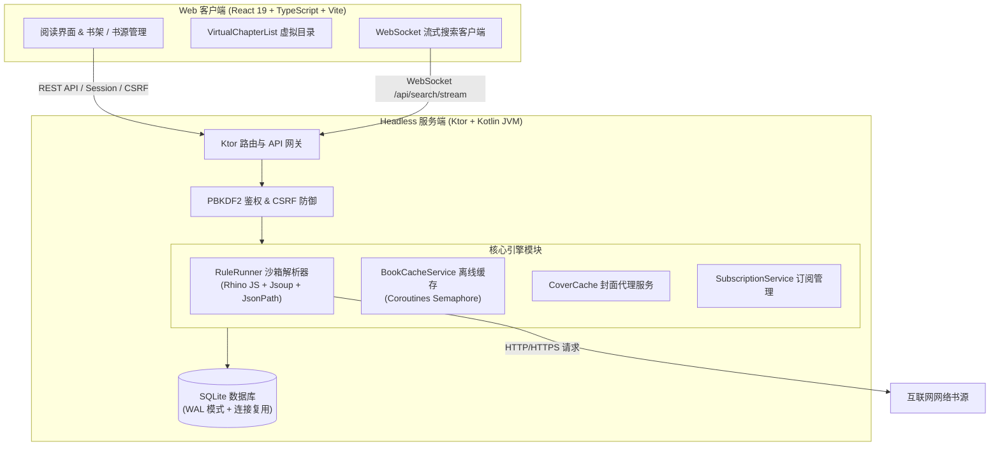

<div align="center">

# 📖 Legado Server

**开源阅读（Legado）Headless 服务端与现代化 Web 客户端**

[](https://kotlinlang.org/)
[](https://ktor.io/)
[](https://react.dev/)
[](https://www.typescriptlang.org/)
[](https://vitejs.dev/)
[](https://sqlite.org/)
[](https://www.docker.com/)
[](LICENSE)

</div>

---

## 📌 项目定位与愿景

**Legado Server** 是针对流行开源阅读软件 **[Legado（开源阅读 Android 端）](https://github.com/LegadoTeam/legado)** 的独立服务端重构版本。

本项目彻底剥离了 Android Framework 原生依赖，在纯 JVM 环境下构建了高性能**无头后端（Headless Server）**，并配套提供了基于 **React 19 + TypeScript + Vite** 的现代化**Web 阅读器与管理控制台**。用户可以在 VPS、家庭 NAS、个人电脑或 Docker 容器中快速部署属于自己的私有化云端书源中心与跨平台阅读平台。

---

## ✨ 核心特性

### 🌐 1. 服务端无头架构（Headless & Pure JVM）
- **零 Android 依赖**：纯 Kotlin JVM + Ktor 异步轻量级服务，运行内存低、启动迅速。
- **沙箱化书源解析引擎**：内置 **Rhino JS 沙箱 + Jsoup + JsoupXpath + JsonPath**，深度兼容 Legado 现存的各类 JSON 书源规则与纯 JavaScript 自定义脚本源。
- **健壮的数据存储**：采用 SQLite 持久化存储，启用 WAL（Write-Ahead Logging）高性能并发写入模式与连接生命周期治理。

### ⚡ 2. 高并发流式搜索（Streaming Search）
- **WebSocket 实时流式推送**：搜索请求通过 WebSocket (`/api/search/stream`) 进行各书源并发检索，书籍信息边搜边出，告别漫长等待。
- **非阻塞式解析**：封面解析与候选源校验异步化处理，极大降低网络级联阻塞。

### 📖 3. 现代化沉浸式 Web 阅读器
- **超大目录虚拟化滚动**：内置 `VirtualChapterList` 虚拟化渲染引擎，5,000+ 章节目录秒级载入，固定 DOM 节点占用，丝滑 60 FPS 滚动并自动定位当前章节。
- **单书源极速直连秒开**：开卷优先拉取主书源正文，候选书源按需懒加载，彻底消除开卷时的网络风暴。
- **多书源无缝切换**：书架支持实时换源与同名匹配，平滑迁移阅读进度。
- **自适应与阅读定制**：支持深色/浅色/护眼多主题切换、字体与字号调节、行高与段距设定、阅读进度双向自动同步。

### 💾 4. 离线书籍缓存与封面代理
- **受限并发下载**：基于 Kotlin 协程信号量（`Semaphore`）调度后台全本/分卷缓存任务，防止触发目标站点限流。
- **断点续传与 $O(1)$ 快速跳过**：智能判定已缓存章节，支持任务中断后无缝恢复。
- **封面防盗链穿透与本地缓存**：内置封面缓存与防盗链代理，书籍海报展示稳定快速。

### 🔄 5. 书源管理与订阅中心
- **多渠道导入**：支持书源 JSON 批量文本导入、文件上传、网络 URL 导入。
- **源订阅自动同步**：支持添加书源订阅源，自动定时拉取更新与手动一键同步。
- **源规则在线校验**：实时分析书源有效性、字段完整性与语法告警。

### 🔒 6. 生产级安全防护
- **PBKDF2 安全密码散列**：防彩虹表破解，支持安全 CLI 密码重置工具。
- **全链路防护**：内置 Secure/HttpOnly 会话管理、CSRF 令牌防御与防暴力破解策略。

---

## 🏗️ 架构设计



---

## 🚀 快速开始与部署

### ⚡ 方式一：一行命令极速启动（Docker CLI）

无需克隆代码仓库，直接运行以下命令即可拉取多架构镜像（支持 x86_64 / ARM64）并启动服务。

> [!TIP]
> **镜像地址说明：**
> - 🇨🇳 **国内加速镜像（阿里云容器镜像服务，推荐国内环境使用）**：
>   `crpi-lup94py5f7l0oclt.cn-beijing.personal.cr.aliyuncs.com/lukelzlz/legado-server:latest`
> - 🌍 **GitHub 官方镜像（GHCR）**：
>   `ghcr.io/lukelzlz/legado-server:latest`

#### 🇨🇳 国内环境推荐（阿里云镜像源）

```bash
docker run -d \
  --name legado-server \
  --restart unless-stopped \
  -p 8080:8080 \
  -v ./ls_data:/data \
  -e ADMIN_PASSWORD='your_password_at_least_12_chars' \
  crpi-lup94py5f7l0oclt.cn-beijing.personal.cr.aliyuncs.com/lukelzlz/legado-server:latest
```

> **单行复制版：**
> ```bash
> docker run -d --name legado-server --restart unless-stopped -p 8080:8080 -v ./ls_data:/data -e ADMIN_PASSWORD='your_password_at_least_12_chars' crpi-lup94py5f7l0oclt.cn-beijing.personal.cr.aliyuncs.com/lukelzlz/legado-server:latest
> ```

#### 🌍 海外 / 国际环境（GitHub Packages GHCR）

```bash
docker run -d \
  --name legado-server \
  --restart unless-stopped \
  -p 8080:8080 \
  -v ./ls_data:/data \
  -e ADMIN_PASSWORD='your_password_at_least_12_chars' \
  ghcr.io/lukelzlz/legado-server:latest
```

> **单行复制版：**
> ```bash
> docker run -d --name legado-server --restart unless-stopped -p 8080:8080 -v ./ls_data:/data -e ADMIN_PASSWORD='your_password_at_least_12_chars' ghcr.io/lukelzlz/legado-server:latest
> ```

- **访问 Web 端**：浏览器打开 `http://127.0.0.1:8080`，输入您设置的 `ADMIN_PASSWORD` 登录。
- **重置密码（如遗忘）**：
  ```bash
  docker exec -it legado-server /app/bin/legado-server reset-password 'new_password_at_least_12_chars'
  ```

---

### 📦 方式二：Docker Compose 编排部署

#### 选项 A：使用预编译镜像直接部署（无需源码）

新建 `docker-compose.yml` 文件：

```yaml
services:
  legado-server:
    # 国内环境推荐阿里云镜像；海外可替换为 ghcr.io/lukelzlz/legado-server:latest
    image: crpi-lup94py5f7l0oclt.cn-beijing.personal.cr.aliyuncs.com/lukelzlz/legado-server:latest
    container_name: legado-server
    restart: unless-stopped
    ports:
      - "8080:8080"
    environment:
      ADMIN_PASSWORD: your_password_at_least_12_chars
      LEGADO_SECURE_COOKIES: "true"
    volumes:
      - ./ls_data:/data
```

启动服务：
```bash
docker compose up -d
```

#### 选项 B：克隆仓库源码构建

1. **克隆代码仓库**
   ```bash
   git clone https://github.com/lukelzlz/legado-server.git
   cd legado-server
   ```

2. **配置环境变量**
   ```bash
   cp .env.example .env
   ```
   编辑 `.env` 文件，填入您的初始管理员密码：
   ```env
   ADMIN_PASSWORD=your_secure_password_at_least_12_chars
   ```

3. **构建并启动容器**
   ```bash
   docker compose --env-file .env -f compose.server.yml up -d --build
   ```

4. **访问服务**
   打开浏览器访问：`http://127.0.0.1:8080`，使用配置的密码登录即可。

5. **重置管理员密码（如遗忘）**
   ```bash
   docker compose --env-file .env -f compose.server.yml run --rm legado-server reset-password 'new_password_at_least_12_chars'
   ```

> [!TIP]
> 生产环境建议通过 Nginx / Caddy 配置 HTTPS 反向代理，并开启 WebSocket 升级支持。

---

### 🛠️ 方式三：本地源码编译与开发运行

#### 环境要求
- **Java**: JDK 17+（推荐 JDK 21）
- **Node.js**: Node.js 20+ / npm 10+

#### 1. 前端构建 / 开发模式
```bash
cd web
npm install

# 启动 Vite 开发服务器 (热重载)
npm run dev

# 执行前端类型检查与单元测试
npm run check
npx tsx test/run-all.ts

# 打包生产静态资源到 web/dist
npm run build
```

#### 2. 服务端运行与测试
```bash
# 根目录下运行服务端测试
./gradlew :server:test

# 启动 Ktor 本地服务端
./gradlew :server:run

# 打包独立分发产物
./gradlew :server:installDist
```

---

## ⚙️ 环境变量配置

服务端支持通过环境变量进行定制化配置：

| 环境变量 | 默认值 | 说明 |
|---|---|---|
| `LEGADO_HOST` | `0.0.0.0` | 服务端监听绑定的主机地址 |
| `LEGADO_PORT` | `8080` | 服务端 HTTP / WebSocket 监听端口 |
| `LEGADO_DATA_DIR` | `/data` | 数据持久化根目录（存放数据库与封面） |
| `LEGADO_DATABASE` | `$LEGADO_DATA_DIR/legado.sqlite` | SQLite 数据库文件绝对路径 |
| `ADMIN_PASSWORD` | 无 | 首次初始化时设置的管理员密码（至少 12 位） |
| `LEGADO_SECURE_COOKIES` | `true` | 是否对 Session Cookie 启用 Secure 标记（公网 HTTPS 建议开启） |

---

## 📁 代码目录结构

```text
.
├── server/                      # Ktor 服务端模块 (Kotlin JVM)
│   ├── src/main/kotlin/io/legado/server/
│   │   ├── Application.kt       # 服务启动入口与 Ktor 特性装配
│   │   ├── Auth.kt              # PBKDF2 密码校验、会话管理与 CSRF
│   │   ├── BookCacheService.kt  # 离线书籍章节并发缓存调度引擎
│   │   ├── CoverCache.kt        # 封面拉取、本地存储与防盗链代理
│   │   ├── Database.kt          # SQLite 数据层持久化与 WAL 模式连接池
│   │   ├── Models.kt            # 服务端核心领域数据模型
│   │   ├── Routes.kt            # REST API 与 WebSocket 路由分发
│   │   ├── RuleRunner.kt        # Legado 规则执行器 (Rhino JS + Jsoup)
│   │   └── SubscriptionService.kt # 书源订阅定时与批量同步
│   └── src/test/kotlin/         # 服务端单元测试与端到端场景测试
├── web/                         # Web 前端模块 (React 19 + TypeScript + Vite)
│   ├── src/
│   │   ├── ReaderScreen.tsx     # 沉浸式阅读器界面 & 虚拟大目录
│   │   ├── api.ts               # API 客户端封装与 WebSocket 流式通信
│   │   ├── main.tsx             # 应用程序根路由、书架与书源管理页
│   │   ├── readerSettings.ts    # 阅读器偏好设置持久化
│   │   └── styles.css           # 响应式排版与主题样式表
│   └── test/                    # 前端虚拟列表与性能场景回归测试集
├── modules/                     # 共享核心模块
│   ├── book/                    # 书源规则定义与模型
│   └── rhino/                   # Rhino 引擎定制绑定
├── compose.server.yml           # Docker Compose 编排文件
└── Dockerfile.server            # 多阶段 Dockerfile (Web 构建 + Server 打包)
```

---

## 🌐 Nginx 反向代理配置示例

如需通过公网 HTTPS 访问，推荐在前端部署 Nginx 进行反向代理：

```nginx
server {
    listen 80;
    server_name reader.example.com;
    return 301 https://$host$request_uri;
}

server {
    listen 443 ssl http2;
    server_name reader.example.com;

    ssl_certificate /path/to/cert.pem;
    ssl_certificate_key /path/to/key.pem;

    location / {
        proxy_pass http://127.0.0.1:8080;
        proxy_set_header Host $host;
        proxy_set_header X-Real-IP $remote_addr;
        proxy_set_header X-Forwarded-For $proxy_add_x_forwarded_for;
        proxy_set_header X-Forwarded-Proto $scheme;

        # WebSocket 支持
        proxy_http_version 1.1;
        proxy_set_header Upgrade $http_upgrade;
        proxy_set_header Connection "upgrade";
        proxy_read_timeout 300s;
    }
}
```

---

## 🧪 测试与质量保证

本项目包含完整的后端与前端自动化测试套件：

- **服务端测试**：
  ```bash
  ./gradlew :server:test
  ```
  涵盖规则解析引擎测试 (`RuleRunnerTest`)、数据库 WAL 与连接生命周期测试 (`DatabaseLifecycleTest`)、离线缓存并发与断点续传测试 (`BookCacheServiceTest`) 以及端到端完整业务链路测试 (`E2EScenariosTest`)。

- **Web 端测试**：
  ```bash
  cd web && npx tsx test/run-all.ts
  ```
  涵盖 5,000+ 章节虚拟目录渲染与滚动测试 (`VirtualChapterList.test.ts`)、换源与懒加载逻辑验证 (`LazySourceLoading.test.ts`) 及高压场景测试。

---

## 🤝 鸣谢与致敬

本项目深度依托并致敬以下优秀的开源项目：

- **[Legado (开源阅读 Android 版)](https://github.com/LegadoTeam/legado)**：卓越的书源生态设计与开源贡献。
- **[Ktor](https://ktor.io/)**：灵活高性能的 Kotlin 异步 Web 框架。
- **[React](https://react.dev/) & [Vite](https://vitejs.dev/)**：现代高效的前端构建与开发体验。
- **[Jsoup](https://jsoup.org/) & [JsoupXpath](https://github.com/zhegexiaohuozi/JsoupXpath)**：强大的 HTML/XML 解析与提取器。
- **[Rhino](https://github.com/mozilla/rhino)**：纯 Java 实现的 JavaScript 执行引擎沙箱。
- **[Jayway JsonPath](https://github.com/json-path/JsonPath)**：JSON 数据提取利器。

---

## 📄 开源许可证

本项目基于 **[GPL-3.0 License](LICENSE)** 开源。

