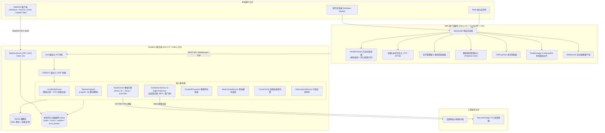

<div align="center">


# Legado Server

**开源阅读（Legado）Headless 服务端与现代化 Web 客户端**

<p align="center">
  <b>简体中文</b> | <a href="./README_EN.md">English</a>
</p>

`#legado` `#legado3` `#开源阅读` `#reader` `#novel-reader` `#book-source` `#headless` `#ktor` `#kotlin` `#react19` `#pwa` `#tts` `#webdav` `#docker` `#epub` `#txt`

[](https://kotlinlang.org/)
[](https://ktor.io/)
[](https://react.dev/)
[](https://www.typescriptlang.org/)
[](https://vitejs.dev/)
[](https://sqlite.org/)
[](https://www.docker.com/)
[](https://computenest.console.aliyun.com/service/instance/create/cn-hangzhou?type=user&ServiceId=service-533806288add4002b02a)
[](https://github.com/lukelzlz/legado-server/actions/workflows/build-jar.yml)
[](LICENSE)

</div>

---

## 📌 项目定位与愿景

**Legado Server** 是针对流行开源阅读软件 **[Legado（开源阅读 Android 端）](https://github.com/LegadoTeam/legado)** 的独立服务端重构版本。

本项目彻底剥离了 Android Framework 原生依赖，在纯 JVM 环境下构建了高性能**无头后端（Headless Server）**，并配套提供了基于 **React 19 + TypeScript + Vite** 的现代化**跨平台 Web 阅读器与管理控制台**。

无论是部署在 VPS、家庭 NAS、个人电脑、轻量 Docker 容器，还是通过阿里云计算巢一键托管，Legado Server 都能为您构建属于自己的私有化云端书源中心、电子书库与沉浸式阅读空间。

---

## ✨ 核心特性

### 🌐 1. 服务端无头架构（Headless & Pure JVM）
- **零 Android 依赖**：纯 Kotlin JVM + Ktor 异步非阻塞轻量技术栈，常驻内存低、极速冷启动。
- **沙箱化书源解析引擎**：内置 **Rhino JS 沙箱 + Jsoup + JsoupXpath + JsonPath**，深度兼容 Legado 现存的全部 JSON 书源规则与 `@js:` 自定义 JavaScript 脚本源。
- **安全替身机制**：针对书源常用的 `JavaImporter` 执行环境提供安全空替身模式，杜绝服务端 RCE 漏洞。
- **健壮的数据存储**：采用 SQLite 持久化存储，启用 WAL（Write-Ahead Logging）高性能并发读写模式与数据库生命周期自治。

### ⚡ 2. 高并发流式搜索（Streaming Search）
- **WebSocket 实时流式推送**：搜索请求通过 WebSocket (`/api/search/stream`) 进行全书源并发检索，书籍信息边搜边出，告别整页等待。
- **非阻塞式解析**：封面拉取、候选源同名归并与有效性校验异步化处理，极大降低网络级联阻塞。

### 📖 3. 现代化沉浸式 Web 阅读器
- **超大目录虚拟化滚动**：内置 `VirtualChapterList` 虚拟滚动引擎，5,000+ 章节目录毫秒级载入，固定 DOM 节点占用，丝滑 60 FPS 滚动并自动居中定位当前章节。
- **单书源极速直连秒开**：开卷优先拉取主书源正文，候选书源按需懒加载，彻底消除开卷时的网络风暴。
- **多书源无缝切换**：书架支持实时换源与同名匹配，平滑迁移阅读进度。
- **双排版视图模式**：支持连续滚动排版与分栏翻页排版，按需自由切换。
- **自适应与阅读定制**：支持深色、浅色、羊皮纸护眼等主题切换，字体、字号、行高与段距无极微调，阅读进度双向自动同步。

### 📚 4. 本地书籍导入与智能排版（TXT / EPUB）
- **全格式支持**：书架支持直接拖拽或点击上传本地 `.txt` 与 `.epub` 电子书文件。
- **智能分章引擎**：针对 TXT 文本内置中文小说分章核心正则（支持“第X章/回/节/卷/篇”、Chapter、序章、引子、楔子、尾声、番外等），自动探测 UTF-8 / GBK / GB2312 / Big5 编码。
- **EPUB 规范解析**：自动解析 EPUB 的 `container.xml`、`content.opf`、`toc.ncx` 目录与元数据，提取内嵌封面图像。
- **艺术字封面动态生成**：对无内嵌封面的书籍，自动基于书名与作者动态生成排版优雅的矢量 SVG 艺术字封面。
- **无缝阅读体验**：本地书籍打上专属「本地」徽标，与网络书籍享受完全相同的目录虚拟化、离线缓存、TTS 朗读与进度同步功能。

### 📦 5. Legado 备份包一键无缝还原
- **全量备份包支持**：在「文件」页面直接上传 Legado Android App 导出的 `backup-*.zip` 备份文件，或从 WebDAV 目录直接一键导入。
- **全量资产还原**：
  - **书源**（`bookSource.json`）：自动还原全部书源定义（含 JSON 源与纯 JS 脚本源），并进行 Source ID 智能归一化。
  - **替换规则**（`replaceRule.json`）：完整恢复净化规则、分组、正则模式与 `@js:` 表达式。
  - **书架与阅读进度**（`bookshelf.json`）：恢复书架藏书、最新阅读章节索引（`durChapterIndex`）与阅读时间戳。
- **安全与内存保护**：严格校验解压体积边界（防止 Zip 炸弹），纯流式内存解析，杜绝 Zip-Slip 路径穿越。

### 🎧 6. Edge-TTS 高音质流式听书与后台播放
- **微软高保真神经音色**：内置 13+ 款优质神经语音（包括晓晓、云希、云健、晓伊、台湾腔晓臻/云哲、粤语晓曼/云龙及英文音色），支持语速、语调无极调节。
- **会话级长音频流**：服务端采用 `MutableSharedFlow` 广播管道与分片前瞻缓冲，下发合规连续 MP3 流，穿透反代缓冲阻断。
- **首帧静音垫底秒播**：连接建立瞬间先下发 144 字节静音帧，使浏览器 `<audio>` 秒入就绪态并即刻激活系统控制中心。
- **视口首个可见段落智能对齐**：在阅读中途开启朗读时，自动定位当前屏幕视口顶部首个完整可见段落作为朗读起点，杜绝跳回章首。
- **跨章无缝连播与防漂移看门狗**：
  - 单句相对时钟动态锚定，彻底根治播放数十分钟后的微小采样漂移死锁；
  - 600ms 尾部静音看门狗，杜绝章末短分片尾部静音停滞；
  - 跨章自动提前预载下一章正文，实现全天候无缝连续朗读。
- **系统级媒体控制（MediaSession）**：原生适配系统锁屏卡片与通知栏控制中心，支持锁屏播放/暂停、切章切句与书籍封面展示。

### 📱 7. 渐进式 Web 应用（PWA）与全脱机离线阅读
- **原生应用级体验**：支持在 Android、iOS、macOS、Windows 及 ChromeOS 上一键「添加到主屏幕 / 安装为桌面应用」，提供独立窗口与沉浸式体验。
- **用户自主正文分段离线**：支持按「后50章 / 后100章 / 全本 / 自定义范围」多协程并发离线下载章节文本至浏览器本地 **IndexedDB**。
- **脱机无网阅读与静默同步**：断网状态下完全依赖本地缓存流畅阅读；离线期间的阅读进度自动记录至本地队列，网络恢复（`online`）后静默同步至服务端。
- **离线可视化状态**：目录列表对已离线章节实时标示绿点徽标（`●`）；内置离线存储管理器，支持查看各书籍缓存占用与 LRU 自动清理。
- **全面屏安全区适配**：全面适配 iOS 刘海屏、灵动岛与 Android 底部手势横条死区（`safe-area-inset-*`），并锁定 `overscroll-behavior: none` 消除橡皮筋下拉卡顿。

### 🧹 8. 替换净化与反爬防混淆规则引擎
- **一级独立导航**：顶部主导航设立独立的「替换规则」管理中心（`#replace-rules`）。
- **反爬错字还原**：完美兼容 Legado 社区的错字对调、同音字混淆还原字典与广告过滤规则。
- **双引擎执行**：同时支持标准正则表达式替换与 `@js:` Rhino JavaScript 沙箱动态计算（自动包装匿名闭包杜绝语法报错）。
- **细粒度作用域**：支持按全局、指定书籍名称、指定作者进行针对性过滤，可分别作用于章节标题与正文。
- **全链路自动生效**：净化规则在正文入库、离线缓存与 TTS 朗读分句前自动应用，确保读到的与听到的皆为纯净文本。

### 🩺 9. 书源批量管理、分组维护与轻量健康体检
- **批量管理体系**：支持多选书源进行批量启用、批量禁用、批量删除以及批量调整所属分组。
- **分组层级视图**：支持自定义分组命名、快速过滤切换与源数量统计。
- **轻量连通性健康体检**：
  - 一键发起全量或分组书源体检；
  - 受控并发对书源的搜索（Search）、发现（Explore）与详情（Detail）接口进行轻量探测；
  - 实时展示书源响应延迟（ms）、成功/失败状态与报错详情；
  - 支持一键禁用体检失败或超时书源，保持书库清爽。
- **内置无头代理登录**：针对需验证码、Cloudflare 或登录凭据的书源，内置安全的 Web 代理登录窗口与 Cookie 同步能力。

### 🗂️ 10. 内置 WebDAV 文件服务与可视化管理
- **零额外进程依赖**：服务端进程原生内置 RFC 4918 Class 1 & 2 规范的 WebDAV 协议端点（`/webdav`），无需单独搭建 Nginx-DAV 或额外 Docker 容器。
- **全平台客户端原生挂载**：直接支持 **Windows 资源管理器网络位置、macOS Finder、RaiDrive、Cyberduck、rclone** 以及 **Legado Android App 备份** 直接挂载读写。
- **完整协议方法支持**：支持 `PROPFIND`、`PUT`（带临时文件原子落盘）、`GET`/`HEAD`（单段 `Range` 断点续传）、`MKCOL`、`DELETE`、`MOVE`、`COPY`、`LOCK`/`UNLOCK`。
- **Web 端可视化面板**：主导航「文件」页展示当前存储占用、客户端接入一键配置代码，并支持网页端文件上传、建文件夹、浏览与删除。

### 💾 11. 离线书籍缓存与封面防盗链代理
- **受限并发下载**：基于 Kotlin 协程信号量（`Semaphore`）调度服务端全本/分卷离线下载任务，防止并发过高触发目标源风控。
- **断点续传与 $O(1)$ 快速跳过**：已缓存章节极速跳过，任务中断后启动即自动续传。
- **封面防盗链穿透与本地缓存**：内置封面缓存与 Referer 防盗链穿透代理，书籍海报展示稳定快速。

### 🔄 12. 书源生态与订阅中心
- **多渠道导入**：支持书源 JSON 批量文本粘贴导入、本地文件上传、网络 URL 导入。
- **生态级语法兼容**：自动容忍 UTF-8 BOM 字符头，自适应 `{ data: [...] }`、`{ sources: [...] }` 等各种包裹结构，允许自定义非标准 `bookSourceUrl`。
- **书源订阅自动同步**：支持添加第三方书源订阅地址，支持定时后台拉取更新与手动一键同步。

### 🔒 13. 生产级安全防护
- **PBKDF2 安全密码散列**：防彩虹表暴力破解，提供安全的独立 CLI 密码重置工具。
- **全链路防御**：内置 Secure/HttpOnly 会话管理、防重放 CSRF 令牌校验与安全反向代理协议检查。

---

## 🏗️ 架构设计



---

## 🚀 快速开始与部署

### ☁️ 方式一：阿里云计算巢一键秒级部署（推荐 · 免运维）

无需手动购买/配置 VPS 或安装 Docker 环境，通过阿里云计算巢即可一键自动化拉起专属的云原生 Legado Server 服务实例（弹性容器实例 ECI + NAS 持久化文件存储 + 独立公网 IP）。

[](https://computenest.console.aliyun.com/service/instance/create/cn-hangzhou?type=user&ServiceId=service-533806288add4002b02a)

- **一键直达链接**：[前往阿里云计算巢一键部署 Legado Server](https://computenest.console.aliyun.com/service/instance/create/cn-hangzhou?type=user&ServiceId=service-533806288add4002b02a)
- **部署步骤**：
  1. 点击上方部署按钮直达计算巢创建页。
  2. 填写 **管理员初始密码**（至少 12 位），其余规格（如 1核 2G 容器规格与网络）保持默认即可。
  3. 点击 **立即创建**，约 1~2 分钟即可完成自动化部署。
  4. 部署成功后在实例详情页点击 **`WebUrl`**（如 `http://<公网IP>:8080`）直接进入 Web 阅读器。
- **计费说明**：软件 100% 免费开源；云资源按实际使用量秒级计费（弹性 ECI 每小时仅需几分钱），可随时一键暂停或彻底释放。

---

### ⚡ 方式二：一行命令极速启动（Docker CLI）

无需克隆代码仓库，直接运行以下命令即可拉取多架构镜像（原生支持 AMD64 / ARM64）并启动服务。

> [!TIP]
> **镜像地址说明：**
> - 🇨🇳 **国内加速镜像（阿里云容器镜像服务，推荐国内环境使用）**：
>   `crpi-lup94py5f7l0oclt.cn-beijing.personal.cr.aliyuncs.com/lukelzlz/legado-server:latest`
> - 🌍 **GitHub 官方镜像（GHCR）**：
>   `ghcr.io/lukelzlz/legado-server:latest`

#### 🇨🇳 国内环境推荐（阿里云镜像源）

```bash
docker run -d \
  --name legado-server \
  --restart unless-stopped \
  -p 8080:8080 \
  -v ./ls_data:/data \
  -e ADMIN_PASSWORD='your_password_at_least_12_chars' \
  crpi-lup94py5f7l0oclt.cn-beijing.personal.cr.aliyuncs.com/lukelzlz/legado-server:latest
```

> **单行复制版：**
> ```bash
> docker run -d --name legado-server --restart unless-stopped -p 8080:8080 -v ./ls_data:/data -e ADMIN_PASSWORD='your_password_at_least_12_chars' crpi-lup94py5f7l0oclt.cn-beijing.personal.cr.aliyuncs.com/lukelzlz/legado-server:latest
> ```

#### 🌍 海外 / 国际环境（GitHub Packages GHCR）

```bash
docker run -d \
  --name legado-server \
  --restart unless-stopped \
  -p 8080:8080 \
  -v ./ls_data:/data \
  -e ADMIN_PASSWORD='your_password_at_least_12_chars' \
  ghcr.io/lukelzlz/legado-server:latest
```

> **单行复制版：**
> ```bash
> docker run -d --name legado-server --restart unless-stopped -p 8080:8080 -v ./ls_data:/data -e ADMIN_PASSWORD='your_password_at_least_12_chars' ghcr.io/lukelzlz/legado-server:latest
> ```

- **访问 Web 端**：浏览器打开 `http://127.0.0.1:8080`，输入您设置的 `ADMIN_PASSWORD` 登录。
- **重置密码（如遗忘）**：
  ```bash
  docker exec -it legado-server /app/bin/legado-server reset-password 'new_password_at_least_12_chars'
  ```

---

### 📦 方式三：Docker Compose 编排部署

#### 选项 A：使用预编译镜像直接部署（无需源码）

新建 `docker-compose.yml` 文件：

```yaml
services:
  legado-server:
    # 国内环境推荐阿里云镜像；海外可替换为 ghcr.io/lukelzlz/legado-server:latest
    image: crpi-lup94py5f7l0oclt.cn-beijing.personal.cr.aliyuncs.com/lukelzlz/legado-server:latest
    container_name: legado-server
    restart: unless-stopped
    ports:
      - "8080:8080"
    environment:
      ADMIN_PASSWORD: your_password_at_least_12_chars
      LEGADO_SECURE_COOKIES: "false" # 明文 HTTP 联调或内网使用设为 false；公网 HTTPS 设为 true
    volumes:
      - ./ls_data:/data
```

启动服务：
```bash
docker compose up -d
```

#### 选项 B：克隆仓库源码构建

1. **克隆代码仓库**
   ```bash
   git clone https://github.com/lukelzlz/legado-server.git
   cd legado-server
   ```

2. **配置环境变量**
   ```bash
   cp .env.example .env
   ```
   编辑 `.env` 文件，填入您的初始管理员密码：
   ```env
   ADMIN_PASSWORD=your_secure_password_at_least_12_chars
   LEGADO_SECURE_COOKIES=false
   ```

3. **构建并启动容器**
   ```bash
   docker compose --env-file .env -f compose.server.yml up -d --build
   ```

4. **访问服务**
   打开浏览器访问：`http://127.0.0.1:8080`，使用配置的密码登录即可。

5. **重置管理员密码（如遗忘）**
   ```bash
   docker compose --env-file .env -f compose.server.yml run --rm legado-server reset-password 'new_password_at_least_12_chars'
   ```

---

### ☕ 方式四：独立可执行 Fat JAR 运行（无需 Docker）

本项目配置了 **GitHub Actions 自动化流水线**，每次代码推送或发布 Release 时均会自动构建开箱即用的 Standalone Fat JAR（内嵌完整 Web 前端资源与纯 JVM 后端引擎）。

#### 1. 获取 JAR 文件
- **GitHub 自动构建产物**：前往仓库的 **Actions** 页面下载最新构建生成的 `legado-server-binaries` Artifacts，或在 **Releases** 页面下载 `legado-server.jar`。
- **本地直接编译**：
  ```bash
  # 编译 Web 前端与服务端独立 JAR
  npm --prefix web run build
  ./gradlew :server:fatJar
  # 生成产物位于 server/build/libs/legado-server-0.1.0-all.jar
  ```

#### 2. 启动服务
运行环境需安装 **Java 17+**（强烈推荐 JDK 21）：
```bash
# 极简启动（默认端口 8080，数据持久化在 ./data）
java -jar legado-server.jar

# 自定义端口、数据目录与管理员密码
LEGADO_PORT=8080 LEGADO_DATA_DIR=./ls_data ADMIN_PASSWORD='your_password_at_least_12_chars' java -jar legado-server.jar
```

#### 3. 命令行重置管理员密码
```bash
java -jar legado-server.jar reset-password 'new_password_at_least_12_chars'
```

---

### 🛠️ 方式五：本地源码编译与开发运行

#### 环境要求
- **Java**: JDK 17+（推荐 Amazon Corretto 21 或 OpenJDK 21）
- **Node.js**: Node.js 20+ / npm 10+

#### 1. 前端构建与开发模式
```bash
cd web
npm install

# 启动 Vite 开发服务器 (支持热重载)
npm run dev

# 执行前端静态类型检查与单测套件
npm run check
npx tsx test/run-all.ts

# 打包生产静态资源到 web/dist
npm run build
```

#### 2. 服务端运行与测试
```bash
# 根目录下运行服务端测试
./gradlew :server:test

# 启动 Ktor 本地服务端
./gradlew :server:run

# 打包独立分发产物
./gradlew :server:installDist
```

---

## ⚙️ 环境变量配置

服务端支持通过环境变量进行定制化配置：

| 环境变量 | 默认值 | 说明 |
|---|---|---|
| `LEGADO_HOST` | `0.0.0.0` | 服务端监听绑定的主机地址 |
| `LEGADO_PORT` | `8080` | 服务端 HTTP / WebSocket / WebDAV 监听端口 |
| `LEGADO_DATA_DIR` | `/data` | 数据持久化根目录（存放数据库 `legado.sqlite`、封面 `covers/`、WebDAV 存储区 `webdav/` 与本地电子书 `local_books/`） |
| `LEGADO_DATABASE` | `$LEGADO_DATA_DIR/legado.sqlite` | SQLite 数据库文件绝对路径 |
| `ADMIN_PASSWORD` | 无 | 首次初始化时设置的管理员密码（至少 12 位） |
| `LEGADO_SECURE_COOKIES` | `true` | 是否对 Session Cookie 启用 Secure 标记（公网 HTTPS 开启；内网明文 HTTP 联调建议设为 `false`，否则浏览器会拒绝发送 Cookie 导致登录失效） |

---

## 🎯 核心能力深度使用指南

### 🗂️ 1. WebDAV 文件服务与 Legado 备份一键还原

服务端原生集成了符合 RFC 4918 Class 1/2 规范的 WebDAV 存储服务端：

#### 连接参数
- **WebDAV 地址**：`http://<服务器IP或域名>:8080/webdav`
- **用户名**：任意填写（如 `legado`，服务端不校验用户名）
- **密码**：您的 `ADMIN_PASSWORD` 管理员密码
- **底层路径**：映射到宿主机的 `LEGADO_DATA_DIR/webdav`（Docker 中为 `/data/webdav`）

#### 快速接入方式
- **Legado Android 备份设置**：在手机 Legado 中打开「设置 > WebDAV 备份」，填写上述地址与凭据，即可一键将手机备份上传到服务器。
- **Windows**：「此电脑」→ 右键「添加一个网络位置」或「映射网络驱动器」→ 输入 WebDAV 地址及凭据。
- **macOS**：Finder → 快捷键 `Cmd + K` → 输入 `http://<服务器>:8080/webdav`。
- **rclone**：
  ```bash
  rclone config create legado webdav url=http://127.0.0.1:8080/webdav vendor=other user=legado pass=$(rclone obscure '你的管理员密码')
  rclone copy ./my-backup.zip legado:backup/
  ```

#### 一键无缝还原 Legado 备份包
进入 Web 端顶栏导航 **「文件」**：
1. **直接上传导入**：在「备份导入」区域点击选择本地导出的 `backup-*.zip` 备份包；
2. **已有文件导入**：在 WebDAV 文件列表中找到已通过客户端上传的 `.zip` 备份文件，点击文件右侧的 **「导入备份」** 按钮；
3. 系统将自动解压并一键还原全部**书源**、**替换净化规则**、**书架书籍**与**当前阅读章节进度**！

---

### 📚 2. 本地电子书导入（TXT / EPUB）与智能排版

不仅可以阅读网络书源，Legado Server 还是一座私人云端电子书库：
- **操作方式**：进入「书架」页面，点击顶部 **「导入本地书」** 按钮，或直接将一个或多个 `.txt` / `.epub` 文件拖入页面即可自动上传。
- **智能分章**：TXT 小说自动探测编码，利用分章正则秒级切出上千章节完整目录。
- **艺术字封面**：没有自带封面的书籍，服务端将自动根据书名和作者渲染精美的矢量艺术字 SVG 封面。
- **阅读无差别**：享受同等的大目录虚拟化、双向进度保存、离线缓存与 Edge-TTS 语音朗读。

---

### 🎧 3. Edge-TTS 神经语音听书与后台播放

在沉浸式阅读器中点击顶栏 **「朗读」** 图标：
- **视口智能对齐**：系统自动计算屏幕视口内顶部第一个可见段落，从当前阅读位置直接开播。
- **优质声线任选**：支持在朗读设置中自由选择微软晓晓（自然女声）、云希（磁性男声）、云健（热血解说）、特色方言（东北话/陕西话/台湾腔/粤语）及英文音色，并支持调节语速、语调。
- **锁屏后台连播**：支持 MediaSession 协议，手机锁屏、通知栏均可直接切章切句并展示书名、作者与封面，结合防漂移看门狗与首帧静音垫底，保障数小时连续播放无断流。

---

### 📱 4. PWA 渐进式应用与离线脱机阅读

- **安装为独立应用**：在 Chrome / Edge / Safari 中点击地址栏的「安装」或 iOS 分享菜单的「添加到主屏幕」，即刻化身无边框原生 App。
- **章节批量离线**：在阅读器抽屉中点击「离线缓存」，支持自选「后50章」、「后100章」、「全本」或自定义范围，多协程并发存入浏览器 IndexedDB。
- **离线脱机阅读**：断网状态下照常阅读离线章节，目录带有绿色 `●` 已离线标记；离线期间的阅读进度会排队暂存，网络重连瞬间自动上报服务器。

---

### 🧹 5. 替换净化与反爬防混淆规则系统

- **入口**：顶栏一级主导航 **「替换规则」**（`#replace-rules`）。
- **规则兼容**：全面兼容 Legado 社区的错字替换与反爬净化规则，支持文本替换、正则表达式替换以及 `@js:` Rhino 脚本动态还原。
- **调试与测试**：在编辑弹窗中输入测试文本，实时预览净化前后对比。
- **全链路集成**：阅读器即时渲染净化后文本，同时离线落盘与 Edge-TTS 朗读均自动经过净化处理。

---

### 🩺 6. 书源批量管理、分组维护与轻量健康体检

- **批量操作**：在「书源」管理页勾选多个书源，支持批量启用、禁用、批量移入指定分组或批量删除。
- **一键体检**：点击「书源体检」，系统通过并发探测书源的检索与正文连通性，直观展示每个书源的延迟毫秒数与报错状态，可一键批量禁用失效源。
- **内置网页登录**：对于需要登录或人机验证的书源，点击「登录」即可呼出安全代理窗口，无缝同步 Cookie 凭据。

---

## 📁 代码目录结构

```text
.
├── server/                              # Ktor 服务端模块 (Kotlin JVM)
│   ├── src/main/kotlin/io/legado/server/
│   │   ├── Application.kt               # 服务启动入口、Ktor 特性装配与优雅停机
│   │   ├── Auth.kt                      # PBKDF2 密码散列、会话管理与 CSRF 防御
│   │   ├── BackupImporter.kt            # Legado .zip 备份包解析与全量还原引擎
│   │   ├── BookCacheService.kt          # 协程受限并发章节离线缓存调度引擎
│   │   ├── ContentProcessor.kt          # 正文净化与替换规则执行引擎 (@js + 正则)
│   │   ├── CoverCache.kt                # 封面抓取、本地磁盘缓存与防盗链代理
│   │   ├── Database.kt                  # SQLite 数据持久层、WAL 模式与连接池自治
│   │   ├── EdgeTtsService.kt            # Microsoft Edge-TTS 神经语音合成客户端
│   │   ├── JsSandbox.kt                 # Rhino JavaScript 安全沙箱与上下文包装
│   │   ├── LocalBookParser.kt           # TXT/EPUB 智能编码探测、正则分章与 SVG 艺术字封面生成
│   │   ├── Models.kt                    # 服务端核心领域实体与序列化 DTO
│   │   ├── NetworkSecurity.kt           # SSRF 防御与私网 IP 安全校验
│   │   ├── ResetPassword.kt             # 管理员密码重置命令行入口
│   │   ├── Routes.kt                    # REST API、WebSocket 流式路由与静态资源托管
│   │   ├── RuleRunner.kt                # Legado 书源规则解析器 (Rhino JS + Jsoup + JsonPath)
│   │   ├── ServerConfig.kt              # 环境变量读取与服务器参数装配
│   │   ├── SourceCodec.kt               # 书源 ID 归一化与外层包裹 JSON 解包器
│   │   ├── StaticWeb.kt                 # 前端 SPA 静态文件路由与 Fallback 映射
│   │   ├── SubscriptionService.kt       # 书源网络订阅定时与批量拉取服务
│   │   ├── TtsSessionService.kt         # 会话级长音频流广播管道与看门狗治理
│   │   ├── WebDavServer.kt              # RFC 4918 Class 1/2 内置 WebDAV 服务端
│   │   └── WebViewProxy.kt              # 书源无头代理登录与 Cookie 凭据抓取沙箱
│   └── src/test/kotlin/                 # 服务端单元测试与端到端场景集成测试套件
├── web/                                 # Web 前端模块 (React 19 + TypeScript + Vite)
│   ├── src/
│   │   ├── AppHeader.tsx                # 全局响应式顶栏与主导航控制器
│   │   ├── Login.tsx                    # 管理员身份验证界面
│   │   ├── main.tsx                     # 根路由、书架网格、搜索控制台与书源管理器
│   │   ├── OfflineCacheModal.tsx        # 离线存储管理与分段批量缓存弹窗
│   │   ├── offlineStorage.ts            # IndexedDB 离线正文缓存与脱机进度队列驱动
│   │   ├── PwaManager.tsx               # PWA 应用安装提示与 Service Worker 更新看门狗
│   │   ├── ReaderScreen.tsx             # 沉浸式阅读器、VirtualChapterList 虚拟大目录与 TTS 对齐
│   │   ├── ReplaceRulesPage.tsx         # 替换净化规则一级主管理页面
│   │   ├── ReplaceRulesModal.tsx        # 替换规则编辑与实时测试弹窗
│   │   ├── SourceGroupModal.tsx         # 书源分组管理弹窗
│   │   ├── SourceHealthModal.tsx        # 书源连通性体检与延迟探测弹窗
│   │   ├── SourceLoginModal.tsx         # 书源登录与 Cookie 代理弹窗
│   │   ├── SourceSwitchModal.tsx        # 实时换源与同名章节智能对齐弹窗
│   │   ├── TtsPlayerBar.tsx             # 悬浮式听书播放控制条
│   │   ├── TtsSettingsModal.tsx         # TTS 神经音色、语速语调调节弹窗
│   │   ├── ttsEngine.ts                 # 双引擎 TTS 调度核心 (Edge-TTS 流与原生合成)
│   │   ├── WebDavSettingsPage.tsx       # WebDAV 服务状态、客户端接入指引与文件/备份管理器
│   │   ├── api.ts                       # 统一 API 客户端与 WebSocket/SSE 流式封装
│   │   └── styles.css                   # 现代化设计系统、主题换肤与全面屏安全区适配
│   └── test/                            # 前端虚拟滚动、离线队列与逻辑回归测试集
├── compose.server.yml                   # 生产级 Docker Compose 编排描述文件
├── Dockerfile.server                    # 多阶段极简容器镜像构建文件 (Node 构建 + Gradle 打包)
├── AGENTS.md                            # 仓库架构宪法约定与部落知识避坑索引库
└── LICENSE                              # GPL-3.0 开源许可协议
```

---

## 🌐 Nginx 反向代理配置示例

在生产环境中推荐通过 Nginx / Caddy 进行 HTTPS 反向代理。以下为生产级配置模版，已针对 **WebSocket 流式搜索**、**SSE 长连接**、**Edge-TTS 连续音频流** 以及 **WebDAV 大文件上传** 进行了完整优化：

```nginx
server {
    listen 80;
    server_name reader.example.com;
    return 301 https://$host$request_uri;
}

server {
    listen 443 ssl http2;
    server_name reader.example.com;

    ssl_certificate /path/to/cert.pem;
    ssl_certificate_key /path/to/key.pem;
    ssl_protocols TLSv1.2 TLSv1.3;
    ssl_ciphers HIGH:!aNULL:!MD5;

    # 放宽单文件上传体积限制以支持大体积本地 EPUB/TXT 与 WebDAV 备份包
    client_max_body_size 200M;

    location / {
        proxy_pass http://127.0.0.1:8080;
        proxy_set_header Host $host;
        proxy_set_header X-Real-IP $remote_addr;
        proxy_set_header X-Forwarded-For $proxy_add_x_forwarded_for;
        proxy_set_header X-Forwarded-Proto $scheme;

        # WebSocket 流式传输支持
        proxy_http_version 1.1;
        proxy_set_header Upgrade $http_upgrade;
        proxy_set_header Connection "upgrade";
        proxy_read_timeout 300s;
        proxy_send_timeout 300s;
    }

    # 针对 TTS 连续长音频流与 SSE 进度推送彻底关闭代理缓冲
    location ~* ^/api/tts/ {
        proxy_pass http://127.0.0.1:8080;
        proxy_set_header Host $host;
        proxy_set_header X-Real-IP $remote_addr;
        proxy_set_header X-Forwarded-For $proxy_add_x_forwarded_for;
        proxy_set_header X-Forwarded-Proto $scheme;

        proxy_buffering off;
        proxy_cache off;
        proxy_read_timeout 600s;
    }

    # 针对 WebDAV 协议端点
    location /webdav {
        proxy_pass http://127.0.0.1:8080;
        proxy_set_header Host $host;
        proxy_set_header X-Real-IP $remote_addr;
        proxy_set_header X-Forwarded-For $proxy_add_x_forwarded_for;
        proxy_set_header X-Forwarded-Proto $scheme;

        proxy_buffering off;
        proxy_request_buffering off; # 避免 Nginx 在转发前缓存完整上传体
        proxy_read_timeout 600s;
    }
}
```

---

## 🧪 测试与质量保证

本项目构建了覆盖核心引擎、协议合规与真实浏览器交互的自动化测试套件：

- **服务端自动化测试**：
  ```bash
  ./gradlew :server:test
  ```
  覆盖规则沙箱解析 (`RuleRunnerTest`)、数据库 WAL 并发与生命周期 (`DatabaseLifecycleTest`)、WebDAV RFC 4918 协议合规与锁机制 (`WebDavServerTest`)、Legado 备份包还原 (`BackupImportTest`)、本地 TXT/EPUB 分章解析 (`LocalBookParserTest`)、Edge-TTS 连续音频流 (`EdgeTtsServiceTest`) 与端到端业务场景测试。

- **Web 端自动化测试**：
  ```bash
  cd web && npm run check && npx tsx test/run-all.ts
  ```
  覆盖 5,000+ 章节超大目录虚拟滚动精度与内存占用 (`VirtualChapterList.test.ts`)、换源与断网离线降级、IndexedDB 脱机缓存队列、替换净化规则匹配、TTS 相对时钟漂移补偿与看门狗验证、WebDAV 客户端接入规范以及真实无头浏览器端到端全链路验证。

---

## 🤝 鸣谢与致敬

本项目深度依托并致敬以下优秀的开源项目与社区生态：

- **[Legado (开源阅读 Android 版)](https://github.com/LegadoTeam/legado)**：卓越的书源生态协议设计与开源奉献。
- **[Ktor](https://ktor.io/)**：灵活高性能的 Kotlin 异步非阻塞 Web 服务端框架。
- **[React](https://react.dev/) & [Vite](https://vitejs.dev/)**：现代高效的前端构建体系与卓越的开发体验。
- **[Jsoup](https://jsoup.org/) & [JsoupXpath](https://github.com/zhegexiaohuozi/JsoupXpath)**：强大的 HTML/XML 解析与 XPath 提取引擎。
- **[Rhino](https://github.com/mozilla/rhino)**：纯 JVM 实现的 JavaScript 安全执行沙箱。
- **[Jayway JsonPath](https://github.com/json-path/JsonPath)**：高效的 JSONPath 规则提取利器。
- **[Microsoft Edge TTS](https://github.com/rany2/edge-tts)**：高保真神经语音合成生态。

---

## 📄 开源许可证

本项目基于 **[GPL-3.0 License](LICENSE)** 开源。
