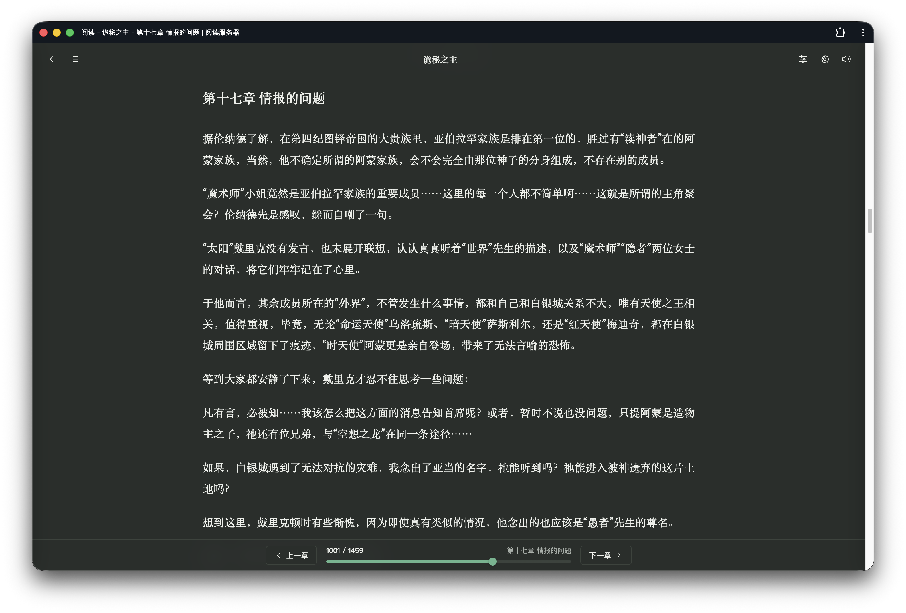
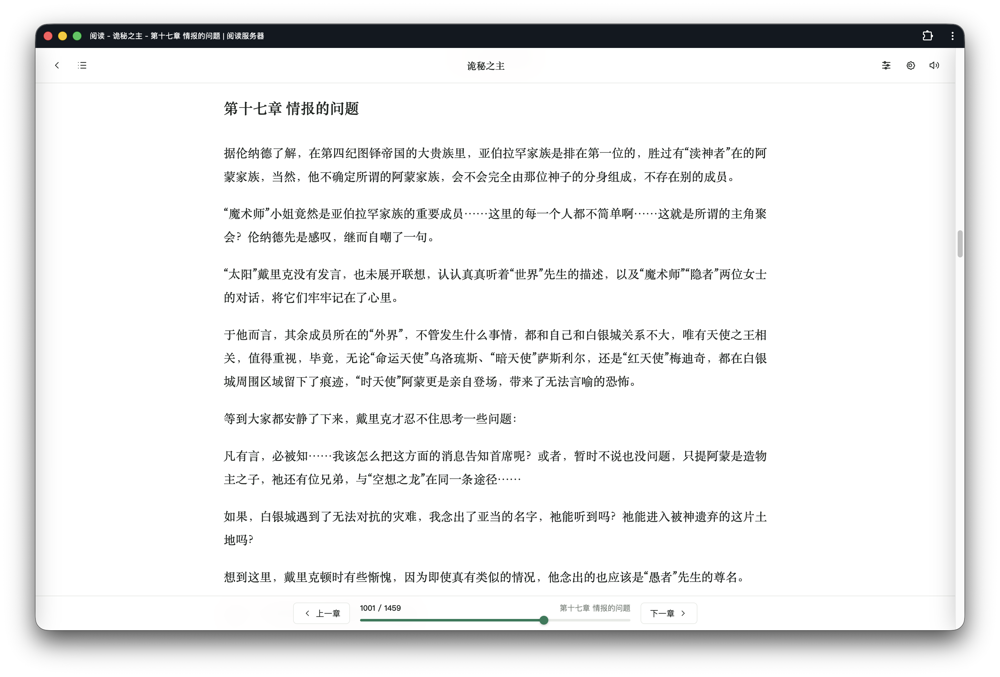
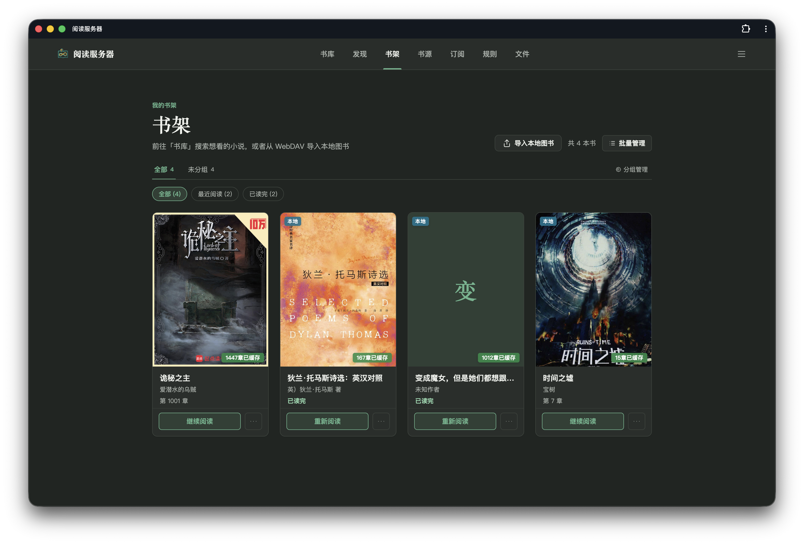
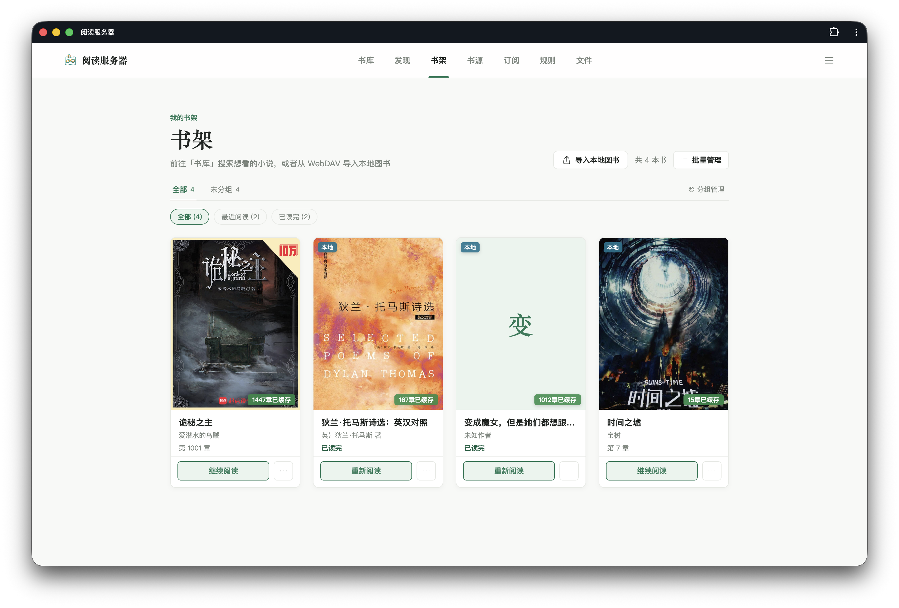
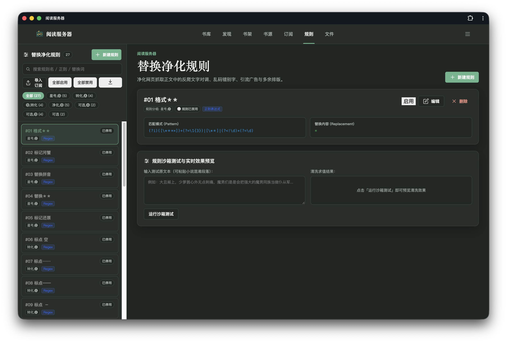
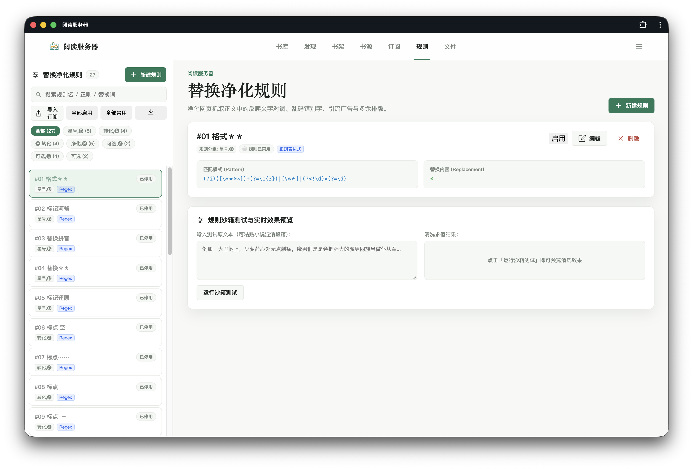

<div align="center">


# Legado Server

**开源阅读（Legado）Headless 服务端与现代化 Web 客户端**

<p align="center">
  <b>简体中文</b> | <a href="./README_EN.md">English</a>
</p>

[](https://kotlinlang.org/)
[](https://ktor.io/)
[](https://react.dev/)
[](https://www.typescriptlang.org/)
[](https://vitejs.dev/)
[](#-全栈多语言-i18n)
[](https://sqlite.org/)
[](https://www.docker.com/)
[](https://computenest.console.aliyun.com/service/instance/create/cn-hangzhou?type=user&ServiceId=service-533806288add4002b02a)
[](https://github.com/lukelzlz/legado-server/actions/workflows/build-jar.yml)
[](LICENSE)

</div>

---

## 📖 项目简介

**Legado Server** 是将流行开源阅读应用 **[Legado（开源阅读 Android 端）](https://github.com/LegadoTeam/legado)** 解耦重构的现代化独立服务端与 Web 客户端。

彻底摆脱 Android 平台依赖，基于 **Kotlin JVM + Ktor** 打造极速、轻量的无头后端，并搭配 **React 19 + TypeScript + Vite** 构建跨平台 Web 阅读控制台。无论是 VPS、家用 NAS、本地容器还是云原生托管，都能秒级搭建属于你的私有云端书源中心与数字书库。

---

## 📸 界面预览

<div align="center">

### 📖 沉浸式阅读器（双栏/单栏排版 · 无限瀑布流 · 深浅色模式自适应）

| 深色模式 (Dark) | 浅色模式 (Light) |
| :---: | :---: |
|  |  |

### 📚 现代化书架（本地书与网络小说同构 · 进度同步 · 分组管理）

| 深色模式 (Dark) | 浅色模式 (Light) |
| :---: | :---: |
|  |  |

### 🧹 替换净化规则中心（多维规则管理 · 正则 / @js 沙箱 · 实时效果预览）

| 深色模式 (Dark) | 浅色模式 (Light) |
| :---: | :---: |
|  |  |

</div>

---

## ⚡ 极速启动（1 分钟部署）

### 🐳 方式一：Docker 一行命令（最推荐）

> [!TIP]
> 国内环境推荐使用阿里云镜像加速，海外环境推荐使用 GitHub GHCR 镜像。密码要求至少 12 位。

**国内加速镜像（阿里云）：**
```bash
docker run -d --name legado-server --restart unless-stopped -p 8080:8080 \
  -v ./ls_data:/data -e ADMIN_PASSWORD='your_password_at_least_12_chars' \
  crpi-lup94py5f7l0oclt.cn-beijing.personal.cr.aliyuncs.com/lukelzlz/legado-server:latest
```

**海外镜像（GHCR）：**
```bash
docker run -d --name legado-server --restart unless-stopped -p 8080:8080 \
  -v ./ls_data:/data -e ADMIN_PASSWORD='your_password_at_least_12_chars' \
  ghcr.io/lukelzlz/legado-server:latest
```

启动后在浏览器打开 `http://127.0.0.1:8080`，使用所设密码即可登录。

---

### 📦 方式二：Docker Compose

新建 `docker-compose.yml`：
```yaml
services:
  legado-server:
    image: crpi-lup94py5f7l0oclt.cn-beijing.personal.cr.aliyuncs.com/lukelzlz/legado-server:latest # 海外换 ghcr.io/lukelzlz/legado-server:latest
    container_name: legado-server
    restart: unless-stopped
    ports:
      - "8080:8080"
    environment:
      ADMIN_PASSWORD: your_password_at_least_12_chars
      LEGADO_SECURE_COOKIES: "false" # 本地 HTTP 设为 false，公网 HTTPS 设为 true
    volumes:
      - ./ls_data:/data
```
运行 `docker compose up -d` 即可。

---

### ☁️ 方式三：阿里云计算巢一键免运维托管

点击下方按钮直接在阿里云自动化拉起专属实例（容器 ECI + NAS 持久存储 + 公网 IP），免除本地部署与网络配置烦恼：

[](https://computenest.console.aliyun.com/service/instance/create/cn-hangzhou?type=user&ServiceId=service-533806288add4002b02a)

---

<details>
<summary><b>☕ 展开查看其他运行方式（独立 Fat JAR、源码本地开发与密码重置）</b></summary>

#### 独立 Fat JAR 运行（免 Docker，需 Java 17+）
```bash
# 从 GitHub Releases 或 Actions 下载最新 legado-server.jar
LEGADO_PORT=8080 LEGADO_DATA_DIR=./ls_data ADMIN_PASSWORD='your_password_at_least_12_chars' java -jar legado-server.jar
```

#### 忘记密码时的重置命令
```bash
# Docker 容器重置
docker exec -it legado-server /app/bin/legado-server reset-password 'new_password_at_least_12_chars'

# Fat JAR 重置
java -jar legado-server.jar reset-password 'new_password_at_least_12_chars'
```

#### 本地源码编译与开发
```bash
# 前端 (web/)
cd web && npm install && npm run dev

# 服务端 (根目录)
./gradlew :server:run
```
</details>

---

## ✨ 核心特性一览

| 模块 | 核心能力与技术亮点 |
|---|---|
| **🚀 无头服务端** | 纯 Kotlin JVM + Ktor 非阻塞架构，毫秒级冷启动；内置 **Rhino JS 沙箱 + Jsoup + JsonPath**，深度兼容 Legado JSON 规则与 `@js:` 脚本；SQLite WAL 高性能持久化。 |
| **📖 沉浸式阅读器** | 自研 `VirtualChapterList` 虚拟滚动（5,000+ 章节毫秒秒开、60FPS 流畅滚动）；单书源秒开避免级联风暴；滚动/分栏双排版、深色/羊皮纸主题、多字体微调。 |
| **🌐 全栈多语言** | 原生支持 **简中 (`zh-CN`) / 繁中 (`zh-TW`) / 英文 (`en-US`) / 日文 (`ja-JP`)**；顶栏 2×2 网格切换；服务端 `Accept-Language` 契约国际化，语言偏好云端漫游落库。 |
| **🔄 跨端进度同步** | 深度适配手机端 WebDAV `legado/bookProgress/` 协议；开书时比较章节下标智能对齐，翻页实时回写，实现**手机端 ↔ 网页端双向无缝衔接**。 |
| **🗂️ 书源分组与检索** | 独立分组管理面板（分组统计、重命名、解绑删除、批量加入/移出）；书库页提供专属**范围选项卡**（全部/各分组/未分组），单组定向搜索提速降耗。 |
| **📚 本地书与智能排版** | 书架拖拽上传 `.txt` / `.epub`；自动识别 UTF-8/GBK 编码，秒级智能正则分章；自动动态生成矢量艺术字 SVG 封面；阅读享同等目录虚拟化与 TTS 朗读。 |
| **📦 备份一键还原** | 一键上传手机端 `backup-*.zip`，全量恢复书源、分组、书签、净化规则与阅读进度；**智能识别过滤手机本地路径与听书源**，保持云端纯净。 |
| **🎧 Edge-TTS 听书** | 微软 13+ 款优质神经语音，长音频流直出；开播自动对齐视口顶部段落；单句相对时钟锚定与章末尾部静音看门狗消除漂移卡死；系统 MediaSession 锁屏控制。 |
| **📱 PWA 与脱机阅读** | 支持安装为桌面或手机独立应用；支持自选分段离线缓存到 **IndexedDB**；断网离线阅读，进度排队待网络恢复静默同步；全面屏安全区适配。 |
| **🧹 净化规则与双副本** | 独立「替换规则」中心，支持正则与 `@js:` Rhino 脚本；正文缓存采用 `raw_content`（原文）与 `content`（清洗）**双副本架构**，规则更新一键无损重洗。 |
| **📁 内置 WebDAV** | 进程原生集成 RFC 4918 Class 1/2 WebDAV 端点（`/webdav`），支持 Windows / macOS / rclone / 手机备份直接挂载；Web 端可视化文件管理器。 |

---

## ⚙️ 核心环境变量

| 环境变量 | 默认值 | 说明 |
|---|---|---|
| `LEGADO_PORT` | `8080` | 服务端监听端口（HTTP / WebSocket / WebDAV 通用） |
| `LEGADO_DATA_DIR` | `/data` | 持久化根目录（存储数据库、封面、WebDAV 数据卷及本地书籍） |
| `ADMIN_PASSWORD` | 无 | 管理员初始密码（首次启动必填，至少 12 位） |
| `LEGADO_SECURE_COOKIES` | `true` | Cookie `Secure` 标记。**公网 HTTPS 设为 `true`；内网明文 HTTP 联调需设为 `false`**（否则浏览器不回传 Cookie 会导致登录掉线） |

---

<details>
<summary><b>🏗️ 展开查看系统架构图 (Mermaid)</b></summary>


```mermaid
flowchart TD
    subgraph Clients ["多端接入生态"]
        Browser["现代浏览器 (Desktop / Mobile)"]
        PWAApp["PWA 独立桌面/移动应用"]
        WebDavClients["WebDAV 客户端 (Windows / macOS / rclone)"]
        LegadoApp["Legado 手机端 (备份 / 进度双向同步)"]
    end

    subgraph WebClient ["Web 客户端 (React 19 + TypeScript + Vite)"]
        Nav["AppHeader 响应式导航 (多语言 2x2 网格 / 主题切换)"]
        Reader["ReaderScreen 沉浸式阅读器 (虚拟滚动 + 段落对齐)"]
        Shelf["书架与本地书导入 (TXT / EPUB)"]
        ScopeBar["SearchScopeBar 搜索范围选项卡 (分组定向检索)"]
        SourceMgr["SourceGroupManagerModal (书源分组管理面板)"]
        WebDavUI["文件管理器 & 备份还原面板"]
        TtsUI["TtsPlayerBar 悬浮控制器"]
        PwaMgr["PwaManager & IndexedDB 本地离线分片"]
        WSClient["WebSocket 流式搜索客户端"]
    end

    subgraph HeadlessServer ["Headless 服务端 (Ktor 3.4 + Kotlin JVM)"]
        Router["Ktor 路由与 API 网关"]
        Auth["PBKDF2 鉴权 & CSRF 防御"]
        WebDavEngine["WebDavServer (RFC 4918 Class 1/2)"]
        I18nSvc["I18nMessages 多语言错误解析"]
        
        subgraph CoreServices ["核心服务群"]
            LocalParser["LocalBookParser (编码探测 / 分章 / SVG 封面)"]
            BackupSvc["BackupImporter (备份解析与本地/音频清洗)"]
            ProgressSync["BookProgressSync (手机端进度双向同步与对齐)"]
            TtsSvc["TtsSessionService & EdgeTtsService (流式音频 / 看门狗)"]
            RuleRunner["RuleRunner 解析引擎 (Rhino JS + Jsoup + JsonPath)"]
            Purify["ContentProcessor 双副本替换净化管道"]
            CacheSvc["BookCacheService 离线缓存调度"]
        end
        
        DB[("SQLite 数据库 (WAL 模式 + app_setting 偏好漫游)")]
        DiskStorage[("持久化存储卷 (/data)")]
    end

    Browser --> Nav
    PWAApp --> Nav
    WebDavClients --> WebDavEngine
    LegadoApp --> WebDavEngine

    Nav --> ScopeBar & Reader & Shelf & SourceMgr & WebDavUI & TtsUI & PwaMgr & WSClient
    WebClient -->|REST API / WebSocket / SSE| Router
    Router --> Auth & I18nSvc
    Auth --> CoreServices
    WebDavEngine --> ProgressSync & DiskStorage
    CoreServices --> DB & DiskStorage

    RuleRunner -->|HTTP/HTTPS 抓取| WebSources["互联网各网络书源"]
    TtsSvc -->|WSS 语音合成| EdgeCloud["Microsoft Edge TTS 语音集群"]
```

</details>

---

<details>
<summary><b>🌐 展开查看生产级 Nginx 反向代理配置（含 WebSocket / SSE / TTS / WebDAV 优化）</b></summary>

```nginx
server {
    listen 80;
    server_name reader.example.com;
    return 301 https://$host$request_uri;
}

server {
    listen 443 ssl http2;
    server_name reader.example.com;

    ssl_certificate /path/to/cert.pem;
    ssl_certificate_key /path/to/key.pem;
    client_max_body_size 200M; # 支持大体积本地 EPUB/TXT 与 WebDAV 备份包

    location / {
        proxy_pass http://127.0.0.1:8080;
        proxy_set_header Host $host;
        proxy_set_header X-Real-IP $remote_addr;
        proxy_set_header X-Forwarded-For $proxy_add_x_forwarded_for;
        proxy_set_header X-Forwarded-Proto $scheme;

        # WebSocket 流式搜索支持
        proxy_http_version 1.1;
        proxy_set_header Upgrade $http_upgrade;
        proxy_set_header Connection "upgrade";
        proxy_read_timeout 300s;
    }

    # 针对 TTS 连续长音频流彻底关闭代理缓冲
    location ~* ^/api/tts/ {
        proxy_pass http://127.0.0.1:8080;
        proxy_buffering off;
        proxy_cache off;
        proxy_read_timeout 600s;
    }

    # WebDAV 端点直通
    location /webdav {
        proxy_pass http://127.0.0.1:8080;
        proxy_buffering off;
        proxy_request_buffering off;
        proxy_read_timeout 600s;
    }
}
```

</details>

---

## 🧪 自动化测试套件

```bash
# 前端静态检查与自动化测试（虚拟滚动/TTS/离线队列/多语言等 170+ 用例）
npm --prefix web run check && npx tsx web/test/run-all.ts

# 服务端 JVM 场景与单元测试
./gradlew :server:test
```

---

## 🤝 鸣谢与致敬

- **[Legado (开源阅读 Android 版)](https://github.com/LegadoTeam/legado)**：卓越的书源生态设计与开源奉献。
- **[Ktor](https://ktor.io/)**：灵活高性能的 Kotlin 异步非阻塞 Web 框架。
- **[React](https://react.dev/) & [Vite](https://vitejs.dev/)**：现代高效的前端体系。
- **[Rhino](https://github.com/mozilla/rhino)** & **[Jsoup](https://jsoup.org/)** & **[Jayway JsonPath](https://github.com/json-path/JsonPath)**：高效的纯 JVM 规则解析引擎。
- **[Microsoft Edge TTS](https://github.com/rany2/edge-tts)**：高保真神经语音合成生态。
- **[reader (hectorqin/reader)](https://github.com/hectorqin/reader)**：经典开源阅读服务端实现；本项目的 Kindle / 墨水屏极简版 UI (`/simple`) 深度借鉴并移植了其优秀的墨水屏前端设计。

---

## 📄 开源许可证

本项目基于 **[GPL-3.0 License](LICENSE)** 开源。
