<div align="center">


# Legado Server

**Headless Server & Modern Web Client for Legado (开源阅读)**

<p align="center">
  <a href="./README.md">简体中文</a> | <b>English</b>
</p>

`#legado` `#legado3` `#reader` `#novel-reader` `#book-source` `#headless` `#ktor` `#kotlin` `#react19` `#pwa` `#tts` `#webdav` `#docker` `#epub` `#txt`

[](https://kotlinlang.org/)
[](https://ktor.io/)
[](https://react.dev/)
[](https://www.typescriptlang.org/)
[](https://vitejs.dev/)
[](https://sqlite.org/)
[](https://www.docker.com/)
[](https://computenest.console.aliyun.com/service/instance/create/cn-hangzhou?type=user&ServiceId=service-533806288add4002b02a)
[](https://github.com/lukelzlz/legado-server/actions/workflows/build-jar.yml)
[](LICENSE)

</div>

---

## 📌 Mission & Project Positioning

**Legado Server** is a standalone, server-side headless refactoring and modern web client for the popular open-source reading application **[Legado (开源阅读 for Android)](https://github.com/LegadoTeam/legado)**.

This project completely decouples the core reading engine from the Android Framework. In a pure JVM environment, it provides a high-performance **Headless Server** alongside a modern, cross-platform **Web Reader and Management Console** built with **React 19 + TypeScript + Vite**.

Whether self-hosted on a VPS, home NAS, personal computer, lightweight Docker container, or deployed with one click via Alibaba Cloud Compute Nest, Legado Server provides your very own private cloud book source hub, digital ebook library, and distraction-free reading experience.

---

## ✨ Key Features

### 🌐 1. Pure JVM Headless Architecture
- **Zero Android Framework Dependencies**: Pure Kotlin JVM + Ktor asynchronous non-blocking stack, featuring ultra-low memory footprint and sub-second cold start.
- **Sandboxed Rule Execution Engine**: Integrated **Rhino JS Sandbox + Jsoup + JsoupXpath + JsonPath**, providing complete compatibility with existing Legado JSON book source definitions and pure JavaScript (`@js:`) scripts.
- **Safe Sandbox Stubs**: Sandboxed `JavaImporter` safe stub mechanism preventing Remote Code Execution (RCE) vulnerabilities from untrusted book sources.
- **Resilient Data Persistence**: SQLite persistent storage with Write-Ahead Logging (WAL) mode and automated connection lifecycle management.

### ⚡ 2. High-Concurrency Streaming Search
- **Real-Time WebSocket Streaming**: Search queries run concurrently across all enabled book sources via WebSocket (`/api/search/stream`), streaming matching books to your screen in real time with zero full-page blocking.
- **Non-Blocking Parsing**: Cover fetching, candidate source aggregation, and health verification run asynchronously in background pipelines.

### 📖 3. Modern Immersive Web Reader
- **Virtual Scrolling for Giant Catalogs**: Custom `VirtualChapterList` virtualization engine loads 5,000+ chapter tables of contents in milliseconds with constant DOM footprint, smooth 60 FPS scrolling, and automatic centered positioning on the current chapter.
- **Instant Opening via Direct Source Stream**: Opening a book immediately fetches content from the primary source without waiting for candidate sources, eliminating network connection spikes.
- **Seamless Book Source Switching**: Live source switching with fuzzy title matching and smart chapter alignment to seamlessly migrate your reading progress.
- **Dual Layout Views**: Free switching between continuous vertical scroll mode and paginated horizontal columns.
- **Deep Personalization**: Multiple themes (Dark, Light, Eye-Care Parchment), granular typography adjustment (font family, font size, line height, paragraph spacing), and bidirectional progress synchronization.

### 📚 4. Local E-Book Import & Smart Typography (TXT / EPUB)
- **Broad Format Support**: Directly drag and drop or upload local `.txt` and `.epub` files onto your Bookshelf.
- **Intelligent Chapter Splitting**: Built-in Chinese and English chapter pattern detection regex (supporting "第X章/回/节/卷/篇", "Chapter X", prologue, epilogue, side stories, etc.), with automatic charset detection for UTF-8, GBK, GB2312, and Big5.
- **Full EPUB Specification Support**: Parses `container.xml`, `content.opf`, `toc.ncx`, and spine manifests to extract clean chapters and embedded cover art.
- **Dynamic Artistic Typography Cover Generator**: Automatically creates an elegant SVG typography cover based on book title and author if no cover image is included.
- **Uniform Reading Experience**: Local books receive a dedicated `Local` badge on the shelf and enjoy identical virtualization, offline caching, TTS narration, and progress syncing.

### 📦 5. One-Click Legado Backup Archive Restoration
- **Full Backup Archive Import**: Upload Legado Android `backup-*.zip` archives directly in the "Files" page, or restore existing backup archives from WebDAV storage with one click.
- **Complete Asset Recovery**:
  - **Book Sources** (`bookSource.json`): Restores all sources (JSON & JavaScript scripts) with automatic Source ID normalization.
  - **Replace & Purify Rules** (`replaceRule.json`): Full recovery of purification rules, groups, regex patterns, and `@js:` scripts.
  - **Bookshelf & Reading Progress** (`bookshelf.json`): Restores shelf books, active chapter index (`durChapterIndex`), and read timestamps.
- **Security & Memory Safety**: Strictly bounded decompression limits preventing Zip Bomb attacks, with in-memory streaming extraction preventing Zip-Slip directory traversal.

### 🎧 6. Edge-TTS High-Fidelity Streaming Audiobook
- **Microsoft Neural Voices**: Integrated 13+ premium neural voices (including Xiaoxiao, Yunxi, Yunjian, Xiaoyi, regional accents like Taiwan HsiaoChen / YunJhe, Cantonese HiuMaan / WanLung, and American English Jenny / Guy), with continuous rate and pitch customization.
- **Session-Scoped Continuous Audio Streaming**: Server-side `MutableSharedFlow` broadcast pipeline and lookahead buffer delivering continuous MP3 streams that bypass proxy buffering bottlenecks.
- **Zero-Latency Silence Preamble**: Injects a 144-byte compliant MP3 silence preamble upon connection, activating HTML5 `<audio>` and system media control centers instantly.
- **Smart Viewport Paragraph Alignment**: Clicking "Read Aloud" calculates the top visible paragraph in the reader viewport and begins playback right from where you are reading.
- **Cross-Chapter Continuous Playback & Drift Watchdog**:
  - Sentence-relative clock anchoring eradicates cumulative audio clock drift over hours of listening;
  - 600ms trailing silence stall watchdog prevents end-of-chapter silence freezes;
  - Automatic prefetching of the next chapter's text guarantees uninterrupted continuous playback.
- **System MediaSession Integration**: Native integration with OS lock screen controls and notification cards (play/pause, chapter skipping, lock screen cover art display).

### 📱 7. Progressive Web App (PWA) & Offline Reading
- **Native App Experience**: Install as a standalone PWA on Android, iOS, macOS, Windows, and ChromeOS ("Add to Home Screen" or "Install App"), providing borderless, fullscreen immersive reading.
- **User-Directed Chapter Caching**: Download next 50 chapters, next 100 chapters, full book, or custom chapter ranges directly into browser **IndexedDB** using concurrent coroutines.
- **Offline Reading & Silent Progress Sync**: Read cached chapters without network connectivity; offline progress is queued locally and automatically synced to the server upon reconnection (`online` event).
- **Offline Indicators & Storage Management**: Chapters with local cache display a distinct green indicator (`●`) in the catalog; built-in storage manager displays storage quota per book with LRU auto-eviction.
- **Mobile Safe Area Adaptation**: Full adaptation for iPhone notch, Dynamic Island, and Android gesture navigation bars (`safe-area-inset-*`), with `overscroll-behavior: none` eliminating iOS rubber-banding.

### 🧹 8. Replace & Purify Rules Engine
- **First-Class Navigation**: Dedicated "Replace Rules" management console (`#replace-rules`) in the main navigation.
- **Anti-Crawler De-obfuscation**: Fully compatible with community homophone restoration, typo maps, and ad purification rules.
- **Dual Rule Engine**: Supports standard Regular Expressions and `@js:` Rhino JavaScript sandboxed expressions (automatically wrapped in anonymous closures to prevent syntax errors).
- **Fine-Grained Scopes**: Scope rules globally, by book title, or by author; apply selectively to chapter titles or chapter body text.
- **Global Pipeline Integration**: Rules are applied automatically before caching to disk, saving offline, and TTS sentence splitting, ensuring clean text across reading and audio.

### 🩺 9. Book Source Batch Management, Grouping & Health Check
- **Batch Management**: Multi-select sources to batch enable, disable, delete, or reassign groups.
- **Hierarchical Grouping**: Custom group naming, quick group switching, and source counts.
- **Lightweight Connectivity Health Check**:
  - One-click health check for all sources or specific groups;
  - Controlled concurrent probing of search, explore, and detail endpoints;
  - Real-time response latency (ms), success/failure status, and error details;
  - One-click disabling of broken or timed-out sources.
- **Built-in Proxy Web Login**: Embedded secure web proxy sandbox for sources requiring CAPTCHAs, Cloudflare checks, or web cookie authorization.

### 🗂️ 10. Built-in WebDAV File Server & Visual File Manager
- **Zero Extra Processes**: Embedded RFC 4918 Class 1 & 2 compliant WebDAV endpoint (`/webdav`), requiring no external Nginx-DAV or secondary container.
- **Native Mounting Across Operating Systems**: Direct mounting via **Windows Map Network Drive, macOS Finder (Cmd+K), RaiDrive, Cyberduck, rclone**, and **Legado Android WebDAV Backup**.
- **Complete Protocol Support**: Supports `PROPFIND`, `PUT` (with atomic file replacement), `GET`/`HEAD` (with single-range `Range` resuming), `MKCOL`, `DELETE`, `MOVE`, `COPY`, `LOCK`/`UNLOCK`.
- **Web-Based Management Console**: The "Files" page in the navigation displays storage statistics, one-click connection configs, file upload, directory creation, browsing, and deletion.

### 💾 11. Offline Server Cache & Anti-Hotlinking Cover Proxy
- **Controlled Concurrency**: Kotlin coroutines semaphore scheduling for server-side full book/batch caching to prevent IP rate-limiting by source websites.
- **Breakpoint Resumption & $O(1)$ Fast Skip**: Cached chapters are skipped instantly; interrupted jobs resume seamlessly upon restart.
- **Anti-Hotlinking Cover Proxy**: Server-side disk caching and Referer spoofing ensure book cover posters load reliably.

### 🔄 12. Book Source Ecosystem & Subscription Hub
- **Multiple Import Channels**: Import book sources via JSON text paste, file upload, or remote URLs.
- **High Compatibility**: Tolerant to UTF-8 BOM headers, automatically unwraps arbitrary JSON structures (`{ data: [...] }`, `{ sources: [...] }`), and permits non-HTTP custom source URLs.
- **Automatic Subscription Sync**: Add third-party subscription URLs with scheduled background polling and one-click manual synchronization.

### 🔒 13. Production-Grade Security
- **PBKDF2 Password Hashing**: Resistant to rainbow table attacks, accompanied by a secure standalone CLI password reset utility.
- **Defense in Depth**: Secure/HttpOnly session cookies, replay-resistant CSRF tokens, and reverse proxy protocol verification.

---

## 🏗️ Architecture Design

```mermaid
flowchart TD
    subgraph Clients ["Multi-Client Ecosystem"]
        Browser["Modern Web Browsers (Desktop / Mobile)"]
        PWAApp["PWA Standalone App Shell"]
        WebDavClients["WebDAV Clients<br/>(Windows / macOS / rclone / Legado App)"]
    end

    subgraph WebClient ["Web Client Architecture (React 19 + TypeScript + Vite)"]
        Nav["AppHeader Responsive Navigation"]
        Reader["ReaderScreen Immersive Reader<br/>(Virtual Scrolling + Viewport TTS Alignment)"]
        Shelf["Bookshelf & Local Book Uploader (TXT / EPUB)"]
        WebDavUI["File Manager & Backup Restore Panel"]
        RuleUI["Replace Rules Console (#replace-rules)"]
        TtsUI["TtsPlayerBar Floating Player"]
        PwaMgr["PwaManager & IndexedDB Offline Storage"]
        WSClient["WebSocket Streaming Search Client"]
    end

    subgraph HeadlessServer ["Headless Server (Ktor 3.4 + Kotlin JVM)"]
        Router["Ktor Routing & API Gateway"]
        Auth["PBKDF2 Authentication & CSRF Guard"]
        WebDavEngine["WebDavServer (RFC 4918 Class 1/2)"]
        
        subgraph CoreServices ["Core Services Pipeline"]
            LocalParser["LocalBookParser<br/>(Smart Splitting & SVG Cover Generation)"]
            BackupSvc["BackupImporter<br/>(Legado .zip Extraction & Restore)"]
            TtsSvc["TtsSessionService & EdgeTtsService<br/>(Neural Streaming MP3 & Watchdogs)"]
            RuleRunner["RuleRunner Engine<br/>(Rhino JS + Jsoup + JsonPath)"]
            Purify["ContentProcessor Replace & Purify Pipeline"]
            CacheSvc["BookCacheService Offline Caching"]
            CoverSvc["CoverCache Anti-Hotlink Proxy"]
            SubSvc["SubscriptionService Auto Sync"]
        end
        
        DB[("SQLite Database<br/>(WAL Mode + Connection Pool)")]
        DiskStorage[("Persistent Data Volume (/data)<br/>(sqlite / covers / webdav / local_books)")]
    end

    subgraph CloudSources ["Upstream Services"]
        WebSources["Internet Book Sources"]
        EdgeCloud["Microsoft Edge TTS Cluster"]
    end

    Browser --> Nav
    PWAApp --> Nav
    WebDavClients -->|WebDAV RFC 4918| WebDavEngine

    Nav --> Reader & Shelf & WebDavUI & RuleUI & TtsUI & PwaMgr & WSClient
    WebClient -->|REST API / WebSocket / SSE| Router
    Router --> Auth
    Auth --> CoreServices
    WebDavEngine --> DiskStorage
    CoreServices --> DB & DiskStorage

    RuleRunner -->|HTTP/HTTPS Crawling| WebSources
    TtsSvc -->|WSS Speech Synthesis| EdgeCloud
```



---

## 🚀 Quick Start & Deployment

### ☁️ Method 1: Alibaba Cloud Compute Nest (Recommended · Zero Ops)

Launch a private Legado Server instance on Alibaba Cloud with automated provisioning (Elastic Container Instance ECI + NAS persistent storage + public IP).

[](https://computenest.console.aliyun.com/service/instance/create/cn-hangzhou?type=user&ServiceId=service-533806288add4002b02a)

- **Direct Deployment Link**: [Deploy Legado Server on Compute Nest](https://computenest.console.aliyun.com/service/instance/create/cn-hangzhou?type=user&ServiceId=service-533806288add4002b02a)
- **Deployment Steps**:
  1. Click the deployment button above to open the creation wizard.
  2. Enter your **Initial Admin Password** (at least 12 characters). Other specifications (e.g., 1 Core 2GB container) can remain at defaults.
  3. Click **Create Now**; provisioning completes in 1–2 minutes.
  4. Once created, click the **`WebUrl`** (e.g., `http://<Public-IP>:8080`) in instance details to log in.
- **Pricing**: The software is 100% free and open-source. Cloud resources are billed per second by actual consumption, and the instance can be paused or released anytime.

---

### ⚡ Method 2: One-Line Docker Run (Docker CLI)

Run the multi-arch container image directly (supporting x86_64 / ARM64):

> [!TIP]
> **Container Registry Selection:**
> - 🌍 **Global / International (GitHub Packages GHCR)**:
>   `ghcr.io/lukelzlz/legado-server:latest`
> - 🇨🇳 **China Mainland Accelerated Mirror (Aliyun ACR)**:
>   `crpi-lup94py5f7l0oclt.cn-beijing.personal.cr.aliyuncs.com/lukelzlz/legado-server:latest`

#### 🌍 Global / International Environment (GHCR)

```bash
docker run -d \
  --name legado-server \
  --restart unless-stopped \
  -p 8080:8080 \
  -v ./ls_data:/data \
  -e ADMIN_PASSWORD='your_password_at_least_12_chars' \
  ghcr.io/lukelzlz/legado-server:latest
```

> **Single-Line Copy:**
> ```bash
> docker run -d --name legado-server --restart unless-stopped -p 8080:8080 -v ./ls_data:/data -e ADMIN_PASSWORD='your_password_at_least_12_chars' ghcr.io/lukelzlz/legado-server:latest
> ```

#### 🇨🇳 China Mainland Environment (Aliyun Mirror)

```bash
docker run -d \
  --name legado-server \
  --restart unless-stopped \
  -p 8080:8080 \
  -v ./ls_data:/data \
  -e ADMIN_PASSWORD='your_password_at_least_12_chars' \
  crpi-lup94py5f7l0oclt.cn-beijing.personal.cr.aliyuncs.com/lukelzlz/legado-server:latest
```

- **Access Web App**: Open `http://127.0.0.1:8080` in your browser and log in with `ADMIN_PASSWORD`.
- **Reset Password (if forgotten)**:
  ```bash
  docker exec -it legado-server /app/bin/legado-server reset-password 'new_password_at_least_12_chars'
  ```

---

### 📦 Method 3: Docker Compose Deployment

#### Option A: Deploy with Prebuilt Image (No Source Code Needed)

Create a `docker-compose.yml` file:

```yaml
services:
  legado-server:
    image: ghcr.io/lukelzlz/legado-server:latest
    container_name: legado-server
    restart: unless-stopped
    ports:
      - "8080:8080"
    environment:
      ADMIN_PASSWORD: your_password_at_least_12_chars
      LEGADO_SECURE_COOKIES: "false" # Set to false for plaintext HTTP; set to true when behind HTTPS reverse proxy
    volumes:
      - ./ls_data:/data
```

Start the container:
```bash
docker compose up -d
```

#### Option B: Build from Git Repository Source

1. **Clone the Repository**
   ```bash
   git clone https://github.com/lukelzlz/legado-server.git
   cd legado-server
   ```

2. **Configure Environment Variables**
   ```bash
   cp .env.example .env
   ```
   Edit `.env` to set your initial administrator password:
   ```env
   ADMIN_PASSWORD=your_secure_password_at_least_12_chars
   LEGADO_SECURE_COOKIES=false
   ```

3. **Build & Start Container**
   ```bash
   docker compose --env-file .env -f compose.server.yml up -d --build
   ```

4. **Access the Service**
   Navigate to `http://127.0.0.1:8080` in your browser.

5. **Reset Password (if needed)**
   ```bash
   docker compose --env-file .env -f compose.server.yml run --rm legado-server reset-password 'new_password_at_least_12_chars'
   ```

---

### ☕ Method 4: Standalone Executable Fat JAR (No Docker Needed)

Standalone Fat JARs containing both embedded Web assets and the complete Kotlin backend engine are automatically compiled on every commit and release via **GitHub Actions**.

#### 1. Download JAR Artifact
- Download `legado-server-binaries` from the **Actions** tab, or get `legado-server.jar` from GitHub **Releases**.
- **Or compile locally**:
  ```bash
  npm --prefix web run build
  ./gradlew :server:fatJar
  # JAR output: server/build/libs/legado-server-0.1.0-all.jar
  ```

#### 2. Run the Service
Requires **Java 17+** (JDK 21 recommended):
```bash
# Minimal execution (port 8080, storage at ./data)
java -jar legado-server.jar

# Custom port, data directory and admin password
LEGADO_PORT=8080 LEGADO_DATA_DIR=./ls_data ADMIN_PASSWORD='your_password_at_least_12_chars' java -jar legado-server.jar
```

#### 3. Reset Admin Password via CLI
```bash
java -jar legado-server.jar reset-password 'new_password_at_least_12_chars'
```

---

### 🛠️ Method 5: Local Source Code Development

#### Prerequisites
- **Java**: JDK 17+ (Amazon Corretto 21 or OpenJDK 21 recommended)
- **Node.js**: Node.js 20+ / npm 10+

#### 1. Frontend Development
```bash
cd web
npm install

# Start Vite dev server with hot reload
npm run dev

# Run type check and unit test suite
npm run check
npx tsx test/run-all.ts

# Build static distribution to web/dist
npm run build
```

#### 2. Backend Development
```bash
# Run server tests from project root
./gradlew :server:test

# Run Ktor server locally
./gradlew :server:run

# Build binary distribution
./gradlew :server:installDist
```

---

## ⚙️ Environment Variables

Configure server runtime behavior using environment variables:

| Variable | Default | Description |
|---|---|---|
| `LEGADO_HOST` | `0.0.0.0` | Host IP address to bind to |
| `LEGADO_PORT` | `8080` | HTTP, WebSocket, and WebDAV listening port |
| `LEGADO_DATA_DIR` | `/data` | Root persistence directory (contains `legado.sqlite`, `covers/`, `webdav/`, and `local_books/`) |
| `LEGADO_DATABASE` | `$LEGADO_DATA_DIR/legado.sqlite` | Absolute file path to the SQLite database |
| `ADMIN_PASSWORD` | *(None)* | Initial admin password (at least 12 characters) |
| `LEGADO_SECURE_COOKIES` | `true` | Enables the `Secure` flag on session cookies (Recommended for HTTPS; set to `false` for local plaintext HTTP testing so browsers send cookies) |

---

## 🎯 Feature Guides

### 🗂️ 1. WebDAV Server & Legado Backup Restoration

Legado Server embeds an RFC 4918 Class 1 & 2 compliant WebDAV server:

#### Connection Parameters
- **WebDAV URL**: `http://<Server-IP-or-Domain>:8080/webdav`
- **Username**: Any string (e.g. `legado`; username is not validated)
- **Password**: Your `ADMIN_PASSWORD`
- **Root Directory**: Mapped to `LEGADO_DATA_DIR/webdav` (`/data/webdav` inside Docker)

#### Client Setup
- **Legado Android App**: Open Settings > WebDAV Backup, enter the URL and credentials to sync backups directly to the server.
- **Windows**: "This PC" > Right click > "Add a network location" or "Map network drive" > Enter WebDAV URL and credentials.
- **macOS**: Finder > `Cmd + K` > Enter `http://<Server>:8080/webdav`.
- **rclone**:
  ```bash
  rclone config create legado webdav url=http://127.0.0.1:8080/webdav vendor=other user=legado pass=$(rclone obscure 'your_password')
  rclone copy ./my-backup.zip legado:backup/
  ```

#### Restoring Legado Backup Archives
In the Web console, click **"Files"** in the top navigation:
1. **Direct Upload**: In the "Backup Import" section, select a local `backup-*.zip` file exported from Legado Android;
2. **From Existing WebDAV Files**: Locate any `.zip` backup file uploaded via WebDAV, and click the **"Import Backup"** button on the row;
3. The server will automatically extract and restore all **Book Sources**, **Replace & Purify Rules**, **Bookshelf Books**, and **Reading Progress**!

---

### 📚 2. Local E-Book Import (TXT & EPUB)

Legado Server functions as your personal cloud ebook library:
- **Import**: Navigate to the "Shelf" page, click **"Import Local Book"**, or drag and drop `.txt` or `.epub` files directly into the window.
- **Smart Splitting**: Automatically detects encodings (UTF-8, GBK, Big5) and splits novel chapters accurately using regex patterns.
- **Artistic Cover Generator**: For books without bundled cover images, the server automatically generates an artistic typography SVG cover with book title and author.
- **Seamless Reading**: Enjoy full catalog virtualization, cross-device reading progress, offline caching, and Edge-TTS narration.

---

### 🎧 3. Edge-TTS Streaming Audiobook & Background Playback

Click the **"Read Aloud"** icon in the reader header:
- **Smart Viewport Alignment**: Playback automatically begins from the first visible paragraph on your screen, avoiding jumping back to the top of the chapter.
- **High-Fidelity Neural Voices**: Choose from Microsoft Xiaoxiao, Yunxi, Yunjian, regional dialects (Taiwan, Cantonese, Northeast, Shaanxi), and English voices, with adjustable rate and pitch.
- **Lock Screen Controls (MediaSession)**: Supports system media cards; play/pause, skip chapters, and view book cover art directly from your lock screen or smartwatch.
- **Stall Watchdog & Anti-Drift**: Equipped with sentence-relative clock re-synchronization and a 600ms trailing silence watchdog to guarantee uninterrupted playback for hours.

---

### 📱 4. PWA & Offline Reading

- **Install as Standalone App**: In Chrome, Edge, or Safari, click "Install" or "Add to Home Screen" for a borderless native app experience.
- **Batch Chapter Offline Caching**: In the reader settings drawer, select "Offline Cache" and choose Next 50 Chapters, Next 100 Chapters, Full Book, or a custom range to store chapters in IndexedDB.
- **Offline Reading**: Read cached chapters without an internet connection; catalog items display a green `●` indicator when cached. Reading progress is saved locally and synced to the server once reconnected.

---

### 🧹 5. Replace & Purify Rules Engine

- **Navigation**: Access the "Replace Rules" page (`#replace-rules`) from the top navigation bar.
- **Full Compatibility**: Compatible with community typo maps and anti-crawler rules; supports plain text, Regex, and `@js:` Rhino JavaScript scripts.
- **Live Debugger**: Test rules against sample text in real time with side-by-side diff previews.
- **Global Integration**: Cleaned text is applied directly in the reader, stored in offline cache, and sent to TTS speech synthesis.

---

### 🩺 6. Book Source Batch Management & Health Checks

- **Batch Operations**: Multi-select sources on the "Sources" page to batch enable, disable, delete, or reassign groups.
- **Health Checks**: Click "Health Check" to probe connectivity across search, explore, and detail endpoints concurrently, displaying latency and error codes. Easily disable failing sources with one click.
- **Embedded Web Login**: Open the secure web proxy modal to complete CAPTCHAs, Cloudflare verifications, or login forms, synchronizing cookies directly to the source.

---

## 📁 Project Directory Structure

```text
.
├── server/                              # Ktor Headless Server (Kotlin JVM)
│   ├── src/main/kotlin/io/legado/server/
│   │   ├── Application.kt               # Application entry point, Ktor plugins & graceful shutdown
│   │   ├── Auth.kt                      # PBKDF2 hashing, session tokens & CSRF protection
│   │   ├── BackupImporter.kt            # Legado .zip backup extraction and restoration engine
│   │   ├── BookCacheService.kt          # Bounded concurrent chapter offline caching engine
│   │   ├── ContentProcessor.kt          # Replace & purify rule evaluation engine (@js & regex)
│   │   ├── CoverCache.kt                # Cover fetching, disk caching & anti-hotlinking proxy
│   │   ├── Database.kt                  # SQLite data access, WAL mode & connection pooling
│   │   ├── EdgeTtsService.kt            # Microsoft Edge-TTS neural synthesis client
│   │   ├── JsSandbox.kt                 # Rhino JavaScript security sandbox & safe stubs
│   │   ├── LocalBookParser.kt           # TXT/EPUB encoding detection, splitting & SVG covers
│   │   ├── Models.kt                    # Domain entities and serialization DTO schemas
│   │   ├── NetworkSecurity.kt           # SSRF protection and private IP filtering
│   │   ├── ResetPassword.kt             # CLI utility for resetting admin password
│   │   ├── Routes.kt                    # REST API, WebSocket streaming routes & static web serving
│   │   ├── RuleRunner.kt                # Legado book source rule parser (Rhino JS + Jsoup + JsonPath)
│   │   ├── ServerConfig.kt              # Environment variable parsing and server configuration
│   │   ├── SourceCodec.kt               # Source ID normalization and JSON unboxing
│   │   ├── StaticWeb.kt                 # Static frontend routing & SPA history fallback
│   │   ├── SubscriptionService.kt       # Third-party book source subscription polling
│   │   ├── TtsSessionService.kt         # Continuous audio streaming pipeline & watchdogs
│   │   ├── WebDavServer.kt              # RFC 4918 Class 1/2 built-in WebDAV server
│   │   └── WebViewProxy.kt              # Headless proxy sandbox for source login & cookie capture
│   └── src/test/kotlin/                 # Server unit tests & end-to-end integration tests
├── web/                                 # Web Frontend (React 19 + TypeScript + Vite)
│   ├── src/
│   │   ├── AppHeader.tsx                # Responsive top navigation header
│   │   ├── Login.tsx                    # Administrator authentication screen
│   │   ├── main.tsx                     # Root SPA router, bookshelf, search console & source manager
│   │   ├── OfflineCacheModal.tsx        # Offline storage management & chapter batch cache modal
│   │   ├── offlineStorage.ts            # IndexedDB offline chapter cache & sync queue driver
│   │   ├── PwaManager.tsx               # PWA install prompt & Service Worker update watchdog
│   │   ├── ReaderScreen.tsx             # Immersive reader, VirtualChapterList & TTS alignment
│   │   ├── ReplaceRulesPage.tsx         # Replace & purify rules management console
│   │   ├── ReplaceRulesModal.tsx        # Replace rule editor with live preview tester
│   │   ├── SourceGroupModal.tsx         # Book source grouping modal
│   │   ├── SourceHealthModal.tsx        # Source connectivity health check & latency probe
│   │   ├── SourceLoginModal.tsx         # Source login & web proxy cookie sync modal
│   │   ├── SourceSwitchModal.tsx        # Live source switching & chapter matching modal
│   │   ├── TtsPlayerBar.tsx             # Floating audiobook player controller
│   │   ├── TtsSettingsModal.tsx         # Neural voice selection, rate and pitch settings
│   │   ├── ttsEngine.ts                 # Dual-engine TTS driver (Edge-TTS streaming & native synthesis)
│   │   ├── WebDavSettingsPage.tsx       # WebDAV status, client guides & file manager
│   │   ├── api.ts                       # Typed API client & WebSocket/SSE streaming helpers
│   │   └── styles.css                   # Modern design system, themes & mobile safe-area CSS
│   └── test/                            # Virtual list, offline cache & UI regression tests
├── compose.server.yml                   # Production Docker Compose definition
├── Dockerfile.server                    # Multi-stage Docker build file (Node + Gradle)
├── AGENTS.md                            # Repository conventions & tribal knowledge baseline
└── LICENSE                              # GPL-3.0 License
```

---

## 🌐 Nginx Reverse Proxy Configuration

When exposing Legado Server to the public internet via HTTPS, Nginx or Caddy is recommended. Below is an optimized Nginx template tuned for **WebSocket search streaming**, **SSE long polling**, **Edge-TTS continuous audio streams**, and **WebDAV file uploads**:

```nginx
server {
    listen 80;
    server_name reader.example.com;
    return 301 https://$host$request_uri;
}

server {
    listen 443 ssl http2;
    server_name reader.example.com;

    ssl_certificate /path/to/cert.pem;
    ssl_certificate_key /path/to/key.pem;
    ssl_protocols TLSv1.2 TLSv1.3;
    ssl_ciphers HIGH:!aNULL:!MD5;

    # Allow large local e-book uploads and WebDAV backups
    client_max_body_size 200M;

    location / {
        proxy_pass http://127.0.0.1:8080;
        proxy_set_header Host $host;
        proxy_set_header X-Real-IP $remote_addr;
        proxy_set_header X-Forwarded-For $proxy_add_x_forwarded_for;
        proxy_set_header X-Forwarded-Proto $scheme;

        # WebSocket Streaming Support
        proxy_http_version 1.1;
        proxy_set_header Upgrade $http_upgrade;
        proxy_set_header Connection "upgrade";
        proxy_read_timeout 300s;
        proxy_send_timeout 300s;
    }

    # Disable proxy buffering for continuous TTS audio streams and SSE
    location ~* ^/api/tts/ {
        proxy_pass http://127.0.0.1:8080;
        proxy_set_header Host $host;
        proxy_set_header X-Real-IP $remote_addr;
        proxy_set_header X-Forwarded-For $proxy_add_x_forwarded_for;
        proxy_set_header X-Forwarded-Proto $scheme;

        proxy_buffering off;
        proxy_cache off;
        proxy_read_timeout 600s;
    }

    # WebDAV Endpoint Optimization
    location /webdav {
        proxy_pass http://127.0.0.1:8080;
        proxy_set_header Host $host;
        proxy_set_header X-Real-IP $remote_addr;
        proxy_set_header X-Forwarded-For $proxy_add_x_forwarded_for;
        proxy_set_header X-Forwarded-Proto $scheme;

        proxy_buffering off;
        proxy_request_buffering off; # Prevents Nginx from buffering entire payload before forwarding
        proxy_read_timeout 600s;
    }
}
```

---

## 🧪 Testing & Verification

Automated test suites ensure reliability across the core engine, protocol compliance, and browser interactions:

- **Server Unit & Integration Tests**:
  ```bash
  ./gradlew :server:test
  ```
  Covers rule sandbox parsing (`RuleRunnerTest`), SQLite WAL concurrency (`DatabaseLifecycleTest`), WebDAV RFC 4918 protocol compliance and locking (`WebDavServerTest`), Legado backup archive restoration (`BackupImportTest`), local TXT/EPUB splitting (`LocalBookParserTest`), Edge-TTS streaming (`EdgeTtsServiceTest`), and end-to-end scenarios.

- **Web Frontend Tests**:
  ```bash
  cd web && npm run check && npx tsx test/run-all.ts
  ```
  Covers 5,000+ chapter catalog virtualization performance (`VirtualChapterList.test.ts`), offline cache queues, replace rule matching, TTS relative clock drift compensation and watchdog recovery, WebDAV client compatibility, and headless browser end-to-end user journeys.

---

## 🤝 Acknowledgements & Credits

Legado Server is built on the shoulders of the following outstanding open-source projects:

- **[Legado (开源阅读 Android)](https://github.com/LegadoTeam/legado)**: Pioneering book source protocol design and open-source contributions.
- **[Ktor](https://ktor.io/)**: Flexible, asynchronous, non-blocking Web framework for Kotlin.
- **[React](https://react.dev/) & [Vite](https://vitejs.dev/)**: Modern frontend build tooling and component architecture.
- **[Jsoup](https://jsoup.org/) & [JsoupXpath](https://github.com/zhegexiaohuozi/JsoupXpath)**: Fast HTML/XML parser and XPath extraction engine.
- **[Rhino](https://github.com/mozilla/rhino)**: Pure JVM JavaScript sandbox execution engine.
- **[Jayway JsonPath](https://github.com/json-path/JsonPath)**: Powerful JSONPath evaluation library.
- **[Microsoft Edge TTS](https://github.com/rany2/edge-tts)**: High-fidelity neural text-to-speech ecosystem.

---

## 📄 License

This project is licensed under the **[GPL-3.0 License](LICENSE)**.
