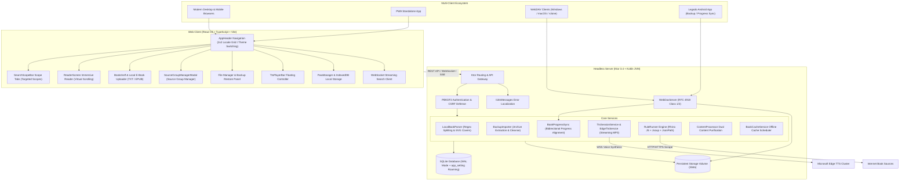

<div align="center">


# Legado Server

**Headless Server & Modern Web Client for Legado (开源阅读)**

<p align="center">
  <a href="./README.md">简体中文</a> | <b>English</b>
</p>

[](https://kotlinlang.org/)
[](https://ktor.io/)
[](https://react.dev/)
[](https://www.typescriptlang.org/)
[](https://vitejs.dev/)
[](#-key-features)
[](https://sqlite.org/)
[](https://www.docker.com/)
[](https://computenest.console.aliyun.com/service/instance/create/cn-hangzhou?type=user&ServiceId=service-533806288add4002b02a)
[](https://github.com/lukelzlz/legado-server/actions/workflows/build-jar.yml)
[](LICENSE)

</div>

---

## 📖 Overview

**Legado Server** is a standalone, server-side headless refactoring and modern web client for the popular open-source reading application **[Legado (开源阅读 for Android)](https://github.com/LegadoTeam/legado)**.

Completely decoupled from the Android framework, it provides a high-performance **Headless Server** built on pure **Kotlin JVM + Ktor**, alongside a modern, cross-platform **Web Reader Console** powered by **React 19 + TypeScript + Vite**. Whether on a VPS, home NAS, local container, or cloud-native platform, set up your private reading hub and digital library in seconds.

---

## ⚡ Quick Start (1-Minute Setup)

### 🐳 Option 1: Docker CLI (Recommended)

> [!TIP]
> Minimum password length is 12 characters. Select the appropriate registry based on your network location.

**Global Registry (GitHub Packages GHCR):**
```bash
docker run -d --name legado-server --restart unless-stopped -p 8080:8080 \
  -v ./ls_data:/data -e ADMIN_PASSWORD='your_password_at_least_12_chars' \
  ghcr.io/lukelzlz/legado-server:latest
```

**China Mirror (Alibaba Cloud Container Registry):**
```bash
docker run -d --name legado-server --restart unless-stopped -p 8080:8080 \
  -v ./ls_data:/data -e ADMIN_PASSWORD='your_password_at_least_12_chars' \
  crpi-lup94py5f7l0oclt.cn-beijing.personal.cr.aliyuncs.com/lukelzlz/legado-server:latest
```

Open `http://127.0.0.1:8080` in your browser and sign in with your configured password.

---

### 📦 Option 2: Docker Compose

Create a `docker-compose.yml`:
```yaml
services:
  legado-server:
    image: ghcr.io/lukelzlz/legado-server:latest # In China: crpi-lup94py5f7l0oclt.cn-beijing.personal.cr.aliyuncs.com/lukelzlz/legado-server:latest
    container_name: legado-server
    restart: unless-stopped
    ports:
      - "8080:8080"
    environment:
      ADMIN_PASSWORD: your_password_at_least_12_chars
      LEGADO_SECURE_COOKIES: "false" # Set to false for plaintext HTTP; true for public HTTPS
    volumes:
      - ./ls_data:/data
```
Run `docker compose up -d`.

---

### ☁️ Option 3: One-Click Deploy on Alibaba Cloud Compute Nest

Automatically provision a managed cloud-native instance (Elastic Container Instance ECI + NAS persistent volume + public IP):

[](https://computenest.console.aliyun.com/service/instance/create/cn-hangzhou?type=user&ServiceId=service-533806288add4002b02a)

---

<details>
<summary><b>☕ Expand for additional runtimes (Standalone Fat JAR, Local Development & Password Reset)</b></summary>

#### Standalone Executable Fat JAR (No Docker, requires Java 17+)
```bash
# Download latest legado-server.jar from Releases or Actions
LEGADO_PORT=8080 LEGADO_DATA_DIR=./ls_data ADMIN_PASSWORD='your_password_at_least_12_chars' java -jar legado-server.jar
```

#### Reset Admin Password (if forgotten)
```bash
# Docker container
docker exec -it legado-server /app/bin/legado-server reset-password 'new_password_at_least_12_chars'

# Fat JAR
java -jar legado-server.jar reset-password 'new_password_at_least_12_chars'
```

#### Local Development & Build
```bash
# Frontend (web/)
cd web && npm install && npm run dev

# Backend (root directory)
./gradlew :server:run
```
</details>

---

## ✨ Key Features

| Capability | Highlights & Engineering Principles |
|---|---|
| **🚀 Headless Architecture** | Pure Kotlin JVM + Ktor asynchronous non-blocking stack; sub-second cold starts; sandboxed **Rhino JS + Jsoup + JsonPath** rule engine with full Legado JSON & `@js:` compatibility; SQLite WAL mode. |
| **📖 Immersive Reader** | Proprietary `VirtualChapterList` virtualization (5,000+ chapters load instantly with 60 FPS scrolling); single-source immediate open eliminating cascade spikes; dual scroll/paginated layout; dark/parchment themes. |
| **🌐 Fullstack i18n** | Native support for **Simplified Chinese (`zh-CN`), Traditional Chinese (`zh-TW`), English (`en-US`), and Japanese (`ja-JP`)**; 2×2 header switcher; RFC 4647 `Accept-Language` API error localization; cloud roaming preferences. |
| **🔄 Mobile Progress Sync** | Native compatibility with the Legado Android WebDAV `legado/bookProgress/` format; automatically compares and adopts larger chapter indices; reciprocal writeback for **bidirectional phone ↔ web continuity**. |
| **🗂️ Groups & Scoped Search** | Dedicated Source Group Manager (stats overview, renaming, unbinding delete, bulk assignment); dedicated search scope tabs (All / Group / Ungrouped) to accelerate searches and minimize bandwidth. |
| **📚 Local E-Books & Typography** | Drag and drop `.txt` and `.epub` files onto your shelf; auto charset detection (UTF-8/GBK) and intelligent regex chapter splitting; dynamic vector SVG typography cover generation. |
| **📦 Backup Restore & Cleanse** | One-click import for Android `backup-*.zip` archives (sources, groups, bookmarks, replace rules, shelf books & progress); **auto-filters mobile-only local paths and audio sources** to keep cloud storage clean. |
| **🎧 Edge-TTS Audiobooks** | 13+ Microsoft neural voices with continuous streaming MP3 output; smart viewport alignment; sentence-relative clock anchoring and trailing silence watchdogs prevent stalls; system MediaSession lock-screen controls. |
| **📱 PWA & Offline Reading** | Installable as a standalone app on desktop and mobile; selective chapter range caching into **IndexedDB**; offline reading with queued progress sync upon reconnect; safe-area notch layout adaptations. |
| **🧹 Purification & Dual Cache** | First-class Replace Rules dashboard (`@js:` Rhino scripts & regex); novel content cache uses a **dual-column architecture** (`raw_content` and `content`), enabling idempotent, lossless batch recleaning. |
| **📁 In-Process WebDAV** | Native RFC 4918 Class 1/2 WebDAV endpoint (`/webdav`); direct mounting from Windows Explorer, macOS Finder, rclone, and mobile backup sync; integrated web file manager. |

---

## ⚙️ Core Environment Variables

| Variable | Default | Description |
|---|---|---|
| `LEGADO_PORT` | `8080` | Server listening port (HTTP / WebSocket / WebDAV) |
| `LEGADO_DATA_DIR` | `/data` | Root directory for persistence (database, covers, WebDAV volume, and local books) |
| `ADMIN_PASSWORD` | None | Initial admin password (required on first launch, at least 12 characters) |
| `LEGADO_SECURE_COOKIES` | `true` | Cookie `Secure` flag. Keep `true` behind HTTPS; set to `false` for local plaintext HTTP. |

---

<details>
<summary><b>🏗️ Expand to view System Architecture Diagram (Mermaid)</b></summary>


```mermaid
flowchart TD
    subgraph Clients ["Multi-Client Ecosystem"]
        Browser["Modern Desktop & Mobile Browsers"]
        PWAApp["PWA Standalone App"]
        WebDavClients["WebDAV Clients (Windows / macOS / rclone)"]
        LegadoApp["Legado Android App (Backup / Progress Sync)"]
    end

    subgraph WebClient ["Web Client (React 19 + TypeScript + Vite)"]
        Nav["AppHeader Navigation (2x2 Locale Grid / Theme Switching)"]
        Reader["ReaderScreen Immersive Reader (Virtual Scrolling)"]
        Shelf["Bookshelf & Local E-Book Uploader (TXT / EPUB)"]
        ScopeBar["SearchScopeBar Scope Tabs (Targeted Scopes)"]
        SourceMgr["SourceGroupManagerModal (Source Group Manager)"]
        WebDavUI["File Manager & Backup Restore Panel"]
        TtsUI["TtsPlayerBar Floating Controller"]
        PwaMgr["PwaManager & IndexedDB Local Storage"]
        WSClient["WebSocket Streaming Search Client"]
    end

    subgraph HeadlessServer ["Headless Server (Ktor 3.4 + Kotlin JVM)"]
        Router["Ktor Routing & API Gateway"]
        Auth["PBKDF2 Authentication & CSRF Defense"]
        WebDavEngine["WebDavServer (RFC 4918 Class 1/2)"]
        I18nSvc["I18nMessages Error Localization"]
        
        subgraph CoreServices ["Core Services"]
            LocalParser["LocalBookParser (Regex Splitting & SVG Covers)"]
            BackupSvc["BackupImporter (Archive Extraction & Cleanse)"]
            ProgressSync["BookProgressSync (Bidirectional Progress Alignment)"]
            TtsSvc["TtsSessionService & EdgeTtsService (Streaming MP3)"]
            RuleRunner["RuleRunner Engine (Rhino JS + Jsoup + JsonPath)"]
            Purify["ContentProcessor Dual Content Purification"]
            CacheSvc["BookCacheService Offline Cache Scheduler"]
        end
        
        DB[("SQLite Database (WAL Mode + app_setting Roaming)")]
        DiskStorage[("Persistent Storage Volume (/data)")]
    end

    Browser --> Nav
    PWAApp --> Nav
    WebDavClients --> WebDavEngine
    LegadoApp --> WebDavEngine

    Nav --> ScopeBar & Reader & Shelf & SourceMgr & WebDavUI & TtsUI & PwaMgr & WSClient
    WebClient -->|REST API / WebSocket / SSE| Router
    Router --> Auth & I18nSvc
    Auth --> CoreServices
    WebDavEngine --> ProgressSync & DiskStorage
    CoreServices --> DB & DiskStorage

    RuleRunner -->|HTTP/HTTPS Scrape| WebSources["Internet Book Sources"]
    TtsSvc -->|WSS Voice Synthesis| EdgeCloud["Microsoft Edge TTS Cluster"]
```

</details>

---

<details>
<summary><b>🌐 Expand to view Production Nginx Reverse Proxy Configuration</b></summary>

```nginx
server {
    listen 80;
    server_name reader.example.com;
    return 301 https://$host$request_uri;
}

server {
    listen 443 ssl http2;
    server_name reader.example.com;

    ssl_certificate /path/to/cert.pem;
    ssl_certificate_key /path/to/key.pem;
    client_max_body_size 200M; # Accommodates large EPUB/TXT uploads & backups

    location / {
        proxy_pass http://127.0.0.1:8080;
        proxy_set_header Host $host;
        proxy_set_header X-Real-IP $remote_addr;
        proxy_set_header X-Forwarded-For $proxy_add_x_forwarded_for;
        proxy_set_header X-Forwarded-Proto $scheme;

        # WebSocket Streaming Support
        proxy_http_version 1.1;
        proxy_set_header Upgrade $http_upgrade;
        proxy_set_header Connection "upgrade";
        proxy_read_timeout 300s;
    }

    # Disable proxy buffering for continuous TTS audio streams
    location ~* ^/api/tts/ {
        proxy_pass http://127.0.0.1:8080;
        proxy_buffering off;
        proxy_cache off;
        proxy_read_timeout 600s;
    }

    # WebDAV Endpoint Passthrough
    location /webdav {
        proxy_pass http://127.0.0.1:8080;
        proxy_buffering off;
        proxy_request_buffering off;
        proxy_read_timeout 600s;
    }
}
```

</details>

---

## 🧪 Verification & Testing

```bash
# Frontend static typechecking and automated test suite (170+ test cases)
npm --prefix web run check && npx tsx web/test/run-all.ts

# Server JVM scenario and unit tests
./gradlew :server:test
```

---

## 🤝 Acknowledgements

- **[Legado (开源阅读 for Android)](https://github.com/LegadoTeam/legado)**: Groundbreaking book source protocol design and open-source contribution.
- **[Ktor](https://ktor.io/)**: Flexible, asynchronous, non-blocking Web framework for Kotlin.
- **[React](https://react.dev/) & [Vite](https://vitejs.dev/)**: Modern, performant frontend architecture.
- **[Rhino](https://github.com/mozilla/rhino)** & **[Jsoup](https://jsoup.org/)** & **[Jayway JsonPath](https://github.com/json-path/JsonPath)**: Efficient pure JVM rule execution engines.
- **[Microsoft Edge TTS](https://github.com/rany2/edge-tts)**: High-fidelity neural speech synthesis ecosystem.
- **[reader (hectorqin/reader)](https://github.com/hectorqin/reader)**: Classic open-source Reader server; our Kindle / E-ink minimalist UI (`/simple`) is heavily inspired by its frontend design.

---

## 📄 License

This project is licensed under the **[GPL-3.0 License](LICENSE)**.
