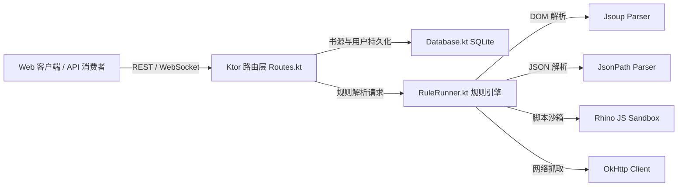

# PROPOSAL-001: Legado 规则执行引擎无头化迁移与 Ktor 服务端架构

## 1. 业务背景与问题痛点
Legado（开源阅读）是 Android 生态中最强大的自定义书源阅读器。然而，其原有实现与 Android SDK 强绑定（依赖 `Activity`、`Context`、`Room`、`Android WebView` 及 Android 专有线程模型），无法直接在 Linux 服务器、Docker 容器或轻量 NAS 设备上运行。

本项目目标是实现**完全脱离 Android 运行时的无头服务端引擎**，并提供标准化的 HTTP RESTful / WebSocket API，使 Web 客户端与第三方服务能够安全、高效地复用海量 Legado 书源生态。

## 2. 目标与非目标 (Goals & Non-Goals)

### 核心目标 (Goals)
1. **纯 JVM / Ktor 技术栈迁移**：彻底剥离所有 Android Framework 依赖，使用 Kotlin JVM + Ktor 构建轻量、跨平台的无头服务端。
2. **规则解析完整兼容**：深度兼容 Legado 书源规范，包括 CSS 选择器（Jsoup）、JsonPath、正则表达式、动态模板语法与多级规则管道。
3. **安全沙箱环境（Rhino JS）**：在纯 JVM 环境中安全执行书源中的 JavaScript 逻辑，提供内置 `java` 工具注入（网络请求、编码转换、正则处理、加密解密）。
4. **服务持久化与鉴权**：提供基于 SQLite 的书源管理、订阅同步与基于 PBKDF2 / Session Cookies 的鉴权机制。

### 非目标 (Non-Goals)
- 不模拟 Android View 绘制与原生 UI 布局。
- 不引入重型浏览器内核（如无头 Chromium / Puppeteer），以保持容器镜像极小体积与低内存开销。
- 不支持仅能在原生 Android App 内执行的专用硬件 API。

## 3. 核心用户故事 (User Stories)

- **Story 1（导入并解析书源）**：作为管理员，通过 Web 界面或 API 导入标准的 Legado JSON 书源（包含单个书源或书源网络订阅 URL），服务端能正确解析、验证并持久化到 SQLite 数据库中。
- **Story 2（执行行内 JS 与规则管道）**：作为阅读器用户，检索包含复杂 JavaScript 动态拼接（如 `@js:`、`<js>`）或多级管道（`{{...}}`）的书源时，服务端沙箱能正确计算出目标 URL、加密签名与清洗后的正文。
- **Story 3（跨平台容器化部署）**：作为运维人员，使用单个 Docker 容器即可快速拉起 Legado Server，在无需配置 Android 虚拟环境的情况下，通过 8080 端口提供全套服务。

## 4. 技术实现架构 (Technical Architecture)

## 5. 验收基准 (Acceptance Criteria)
- [x] `./gradlew :server:test` 单元测试全部通过，覆盖 Jsoup、JsonPath、Rhino 沙箱与规则表达式。
- [x] Docker 容器构建成功，内存基线低于 150MB，无 Android 依赖报错。
- [x] 支持导入并正确运行主流网络书源（支持 JS 搜索与正文二次清洗）。
