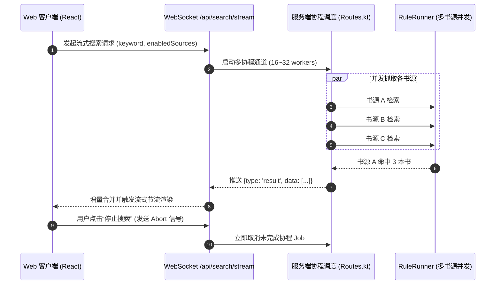

# PROPOSAL-002: 多书源高并发流式搜索与多维智能排序引擎

## 1. 业务背景与问题痛点
在传统的网络小说阅读器中，跨书源全网搜索往往存在以下痛点：
1. **搜索延迟长**：当启用数十个甚至上百个书源时，若等待所有书源全部返回才响应前端，搜索时间长达十数秒甚至超时。
2. **结果散乱与重复**：不同书源对同一本书的命名格式不一（如包含 `[精校]`、`（实体书版）`、`全集`），导致同名同作者书籍在列表中重复堆叠。
3. **低质量书源干扰**：部分书源包含防盗章节、VIP 断章或失效链接，缺乏智能打分与多源综合权重排序。

## 2. 目标与非目标 (Goals & Non-Goals)

### 核心目标 (Goals)
1. **WebSocket / SSE 高并发流式推流**：服务端采用协程调度（16~32 workers 并发），单个书源解析完成即时通过 WebSocket 推送到前端，首结果秒级上屏。
2. **书名/作者智能清洗与同名同作者聚合**：前端 `groupSearchResults` 自动清洗标题噪点（如书名号、标签修饰词），将多书源搜索结果自动归纳为书籍卡片，内部聚合候补源。
3. **多维智能排序与过滤 (Smart Ranking & Filters)**：
   - 支持按**综合热度/权重**、**最新更新时间**、**可用书源数量**、**精准书名匹配**等维度排序。
   - 提供**实时中断（AbortController）**，允许用户随时暂停搜索而不丢失已检索到的结果。

### 非目标 (Non-Goals)
- 不在搜索阶段预先全量抓取各候补书源的完整目录与首章正文（避免网络泛洪与性能浪费）。
- 不对第三方失效书源进行全局封禁，仅在单次检索流中隔离异常并记录错误。

## 3. 核心用户故事 (User Stories)

- **Story 1（秒级流式搜索）**：作为用户，在搜索框输入“诡秘之主”，0.5 秒内即在前端看到首批书源结果流式展示，进度条平滑更新，无需等待全网书源搜索完毕。
- **Story 2（多源自动归一聚合）**：作为用户，在搜索结果中看到一张清晰的《诡秘之主》/ 爱潜水的乌贼卡片，副标题标注“共 12 个可用书源”，点击即可查看各源最新章节与状态。
- **Story 3（主动停止与状态保留）**：作为用户，当找到目标书籍后点击“停止搜索”，系统立即中止后续未完成书源的并发请求，当前已呈现的结果完整保留，且不会意外重启搜索。

## 4. 技术实现架构 (Technical Architecture)

## 5. 验收基准 (Acceptance Criteria)
- [x] 流式搜索支持 30+ 书源并发推流，前端无卡顿渲染（98 项前端单测全绿）。
- [x] 点击“停止搜索”显式分发中断信号，杜绝表单误提交导致的搜索重启。
- [x] 多源聚合与排序算法正确处理书名噪音、未知作者归一与多维度加权排序。
