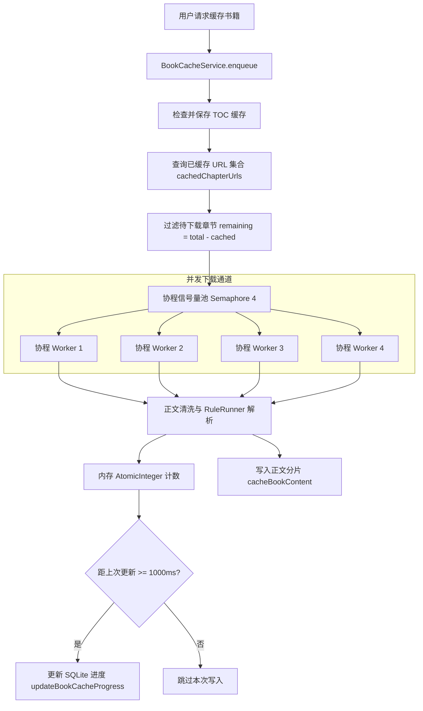

# PROPOSAL-003: 整书离线缓存、断点续传与跨书源书架持久化

## 1. 业务背景与问题痛点
在弱网、移动端离线阅读或书源站点稳定性欠佳的场景下，实时拉取章节内容会导致频繁加载卡顿或章节加载失败。因此，系统需要提供高吞吐、高稳定性的整本小说后台离线缓存能力，并支持跨书源封面与正文融合的书架持久化管理。

## 2. 目标与非目标 (Goals & Non-Goals)

### 核心目标 (Goals)
1. **受限并发整书下载（Bounded Concurrency）**：`BookCacheService` 采用 Kotlin 协程 `Semaphore(4)` 严格控制单书章节下载并发数，既保证下载吞吐，又防止触发目标站点反爬限流。
2. **O(1) 断点续传与章节跳过 (Breakpoint Resume)**：在启动整书下载前预查已缓存章节 URL 集合（`cachedChapterUrls`），跳过已缓存内容，仅下载剩余缺失章节。
3. **内存原子计数与数据库节流写入**：在章节下载循环中消除高开销的 `SELECT COUNT(*)`，采用内存 `AtomicInteger` 计数并在 1000ms 节流窗口内批量持久化缓存进度至 SQLite。
4. **跨书源书架融合与元数据自定义**：支持书架中同一书籍从优质源拉取正文、从另一源获取高清封面与简介；支持自定义书名与封面，并安全处理空封面（`cover_key IS NULL`）场景。

### 非目标 (Non-Goals)
- 不直接存储未经清洗的原始 HTML，仅将提取出的正文纯文本与必要章节分段持久化。
- 不采用无限重试阻塞下载队列，单章重试失败后记录错误并继续后续章节下载。

## 3. 核心用户故事 (User Stories)

- **Story 1（整书后台缓存）**：作为用户，在书籍详情页点击“缓存全本”，服务端在后台异步启动下载任务，前端实时显示进度百分比（如 `450/1200 章 37%`）。
- **Story 2（断点续传与秒开）**：作为用户，在网络中断或服务重启后重新点击缓存，系统自动识别已下载的 450 章并在 1 秒内跳过，直接从第 451 章继续下载。
- **Story 3（跨源封面融合与书架编辑）**：作为用户，将某一本没有封面的书籍加入书架后，可以从备用候补源自动绑定封面，或在书架中自定义上传/修改封面与标题，系统持久化保存并不报错。

## 4. 技术实现架构 (Technical Architecture)

## 5. 验收基准 (Acceptance Criteria)
- [x] `./gradlew :server:test` 中的 `BookCacheServiceTest.kt` 全部通过（验证并发度、续传、取消与异常容忍）。
- [x] 空封面书籍加入书架与编辑元数据无 404 错误。
- [x] 下载期间服务端 CPU 与 SQLite 写锁无死锁或争用超时。
