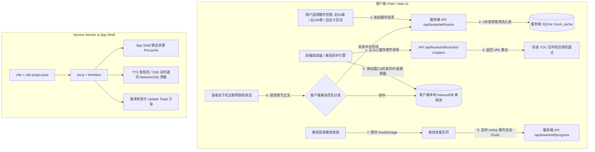

# PROPOSAL-012: 完整 PWA 渐进式 Web 应用能力、用户自主正文分段离线缓存与沉浸式全屏抽屉适配

## 1. 业务背景与痛点

Legado Server 目前作为现代化 Web 阅读器，用户已广泛在桌面浏览器与移动设备（iOS Safari / Android Chrome）上进行高频阅读。然而在移动端和独立桌面使用场景下存在以下明显痛点：

1. **缺失原生应用沉浸体验（PWA Standalone）**：缺乏完整的 Web App Manifest 与 Service Worker 支持，无法添加到主屏幕独立运行（带独立图标、启动页、无浏览器 URL 栏与底栏干扰）。
2. **正文离线缓存缺乏精细化控制与脱机韧性**：
   - 现有系统仅提供“全本缓存”单一操作，无法按需选择“缓存后 50 章”、“缓存后 100 章”或“自定义章节区间”；
   - 缺乏目录（TOC）级别的已缓存状态可视化标识，用户无法直观了解哪些章节已离线、哪些未下载；
   - 缓存数据仅存在服务端 SQLite 中，当手机 PWA 在通勤或飞行模式下真正脱离服务端网络时，客户端无法直接脱机读取正文；
   - 离线阅读后进度存在覆盖风险，缺乏离线书架快照、TTS 离线降级与存储配额管理。
3. **PWA 全屏/独立模式下安全区适配缺陷**：在 iOS/Android 沉浸式全屏（Standalone / Fullscreen）模式下，由于视口顶部刘海屏与状态栏（Safe Area Insets），阅读器的设置抽屉与侧边栏未适配 `env(safe-area-inset-top)` 和 `viewport-fit=cover`，导致抽屉顶栏上移超出屏幕边界、按钮被系统刘海遮挡无法点击。
4. **版本更新无法热感知与平滑切换**：服务端每次迭代更新静态资源后，用户浏览器常因强缓存导致旧版本与新接口不匹配，缺少主动的新版本检测与“点击更新”轻量提示。

---

## 2. 目标与非目标 (Goals & Non-Goals)

### 目标 (Goals)
1. **标准 PWA 规范全套支持**：
   - 完善 Web App Manifest（`name: "阅读"`, `short_name: "阅读"`, `display: "standalone"`, `theme_color`, `background_color`, `shortcuts` 等）。
   - 提供多分辨率矢量/位图图标套件（`192x192`, `512x512`, `maskable`, `apple-touch-icon`, `favicon.svg`）。
   - 捕获 `beforeinstallprompt` 事件，初次进入非 Standalone 模式时底部展示可关闭的轻量气泡卡片“将阅读添加到主屏幕，享受全屏沉浸体验”，并在设置抽屉常驻安装入口。
   - 新版本检测（Prompt 模式），弹出轻量 Toast“发现新版本，点击即刻更新 [立即更新]”，一键 `skipWaiting` 并热重载。
2. **用户自主可控的正文离线缓存体系 (Two-tier Cache & Range Control)**：
   - **分段与自定义区间缓存**：支持“缓存后 50 章”、“缓存后 100 章”、“全本缓存”及“自定义章节区间（从第 X 章到第 Y 章）”。
   - **双层缓存协同（服务端多线程 + PWA 客户端离线同步）**：服务端支持按区间并发抓取入库；客户端提供本地离线同步池（IndexedDB / CacheStorage），即使服务端完全脱机断连也能在手机 PWA 本地阅读已缓存书籍。
   - **离线阅读进度自动静默回写**：离线阅读进度暂存本地，网络恢复时（`online` 事件/请求恢复）自动静默合并回服务端，最新时间戳胜出。
   - **离线书架快照**：断网打开应用时展示本地书架快照，并高亮可离线阅读书籍。
   - **离线 TTS 弹窗确认降级**：断网听书时弹窗确认“当前处于离线状态，是否使用系统本地语音朗读？”，用户确认后无缝调用本地 Web Speech API。
   - **目录（TOC）缓存状态高亮打标**：章节列表中清晰标注每章是否已离线缓存（绿色微标/已下载图标），点击一目了然。
   - **自动追更预载 (Lookahead Prefetch)**：阅读器在后台静默自动预载当前章节后 10~20 章到本地离线池。
   - **设备缓存管理中心与配额保护**：直观查看每本书及全局占用的本地存储大小（MB/章节数），支持单本清除或一键释放空间，提供配额超限熔断提示与可选的 LRU 自动清理配置。
3. **全屏/Standalone 沉浸式安全区与手势适配**：
   - 添加 `<meta name="viewport" content="width=device-width, initial-scale=1.0, viewport-fit=cover" />` 与 iOS 状态栏配置。
   - 全局禁用 rubber-banding 弹性下拉（`overscroll-behavior: none`）。
   - 彻底重构 `.reader-drawer`, `.drawer-header`, `.reader-header`, `.app-header`, `TtsPlayerBar` 在全屏下的顶部/底部安全区（`safe-area-inset-*`）边界，消除溢出与裁切。

### 非目标 (Non-Goals)
- 离线状态下不运行复杂 JS 脚本沙箱规则（正文在服务端抓取落库时已完成替换净化清洗，离线状态直接读取纯净正文，禁用离线规则修改）。

---

## 3. 核心用户故事 (User Stories)

### Story 1: 添加到主屏幕与独立沉浸阅读
- **作为** 移动端读者，
- **当** 我首次使用手机浏览器访问 Legado Web 时，
- **我希望** 底部弹出轻量气泡卡片引导“将阅读添加到主屏幕，享受全屏沉浸体验”，点击后一键安装，
- **以便于** 从桌面图标直接启动沉浸式阅读器，无浏览器地址栏与底栏干扰，宛如原生应用。

### Story 2: 自主选择缓存范围与按需离线
- **作为** 连载小说追更读者，
- **当** 我打开一本上千章的小说时，
- **我希望** 能够自由选择“缓存后 50 章”或“自定义第 100~200 章”，而不是只能全本傻瓜下载，
- **以便于** 极大节省下载时间与服务端/手机存储空间。

### Story 3: 目录可视化缓存状态与完全脱机阅读
- **作为** 经常在地铁/飞行模式下看书的读者，
- **当** 我打开目录抽屉时，
- **我希望** 看到哪些章节右侧带有“已缓存”绿色小圆点；当我断开 WiFi/4G 且服务端无连接时，依然能畅快阅读所有带绿点的章节，
- **以便于** 对离线可用章节心中有数，无惧任何极端断网环境。

### Story 4: 断网阅读进度自动同步与书架快照
- **作为** 离线阅读用户，
- **当** 我在断网环境下连续阅读了多章并恢复网络时，
- **我希望** 系统自动在后台静默将最新阅读进度同步回服务端书架，
- **以便于** 切换到电脑或另一台设备时阅读进度完全一致，绝不发生回滚。

### Story 5: 离线 TTS 智能弹窗降级
- **作为** 听书用户，
- **当** 我在断网时点击朗读按钮，
- **我希望** 弹出提示“当前处于离线状态，是否使用系统本地语音朗读？”，点击确定后即刻使用手机本地自带语音继续朗读，
- **以便于** 离线也能听书不中断。

### Story 6: 设备存储与缓存管理
- **作为** 手机存储空间有限的用户，
- **当** 我在设置中查看离线缓存时，
- **我希望** 清楚看到《某小说》占用了 3.2MB（共 120 章本地缓存），并能一键“清除本书离线数据”或“一键释放全部缓存”，
- **以便于** 轻松掌控本地存储健康。

### Story 7: PWA 全屏刘海屏与安全区完美显示
- **作为** iPhone / Android 异形屏全屏用户，
- **当** 我在 PWA 全屏模式下打开目录抽屉、阅读设置抽屉或换源弹窗时，
- **我希望** 抽屉顶栏与关闭按钮完美对齐在状态栏/刘海下方，不被屏幕物理圆角与摄像头裁切遮挡，且无下拉橡皮筋弹性抖动，
- **以便于** 顺畅进行字体、背景切换与目录跳转。

### Story 8: 无感版本更新与即时提示
- **作为** 长期驻留 PWA 的用户，
- **当** 后端部署了新版本时，
- **我希望** 界面弹出轻量提示“发现新版本，点击即刻更新 [立即更新]”，
- **以便于** 点击后瞬间完成更新与重载，不错过新功能与 Bug 修复。

---

## 4. 架构与交互设计

---

## 5. 验收基准 (Acceptance Criteria)

- [ ] `npm --prefix web run check` 与 `./gradlew :server:test` 全部通过。
- [ ] 后端支持按区间（`startIndex`, `endIndex`, `count`）缓存章节，并提供已缓存章节清单接口与清空接口。
- [ ] 前端支持“缓存后 50 章”、“缓存后 100 章”、“全本缓存”与“自定义章节范围”，并具备进度条与取消功能。
- [ ] 目录抽屉（TOC）精准显示各章节离线状态（已缓存小绿点）。
- [ ] 客户端本地 IndexedDB 离线池工作正常：Chrome DevTools 设置为 Offline 状态时，已离线书籍仍可秒开并翻页阅读。
- [ ] 离线阅读后恢复网络，最新进度自动静默同步至服务端书架。
- [ ] 离线状态下触发 TTS 朗读弹出确认弹窗并平滑调用系统本地 Web Speech 引擎。
- [ ] 缓存管理面板可直观查看占用体积并支持一键清理。
- [ ] PWA Standalone / 全屏模式下，设置抽屉与顶栏完美适配安全区，无越界与刘海遮挡，禁用弹性橡皮筋回弹。
- [ ] PWA Manifest、图标套件、安装引导气泡与新版本 Update Prompt 工作正常。
