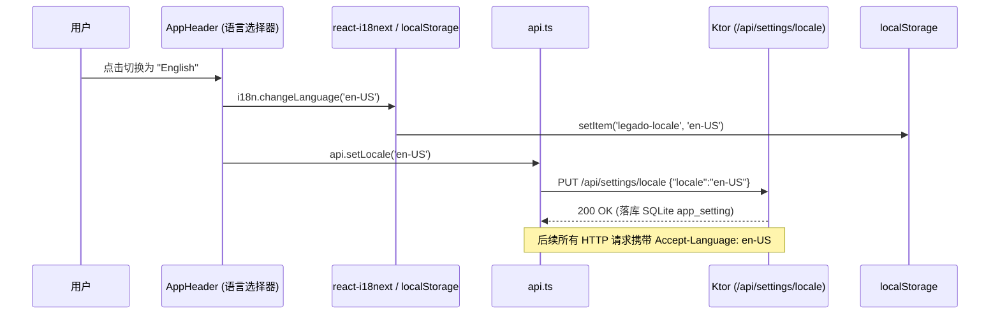

# PROPOSAL-022: 全栈多语言国际化与服务端语言偏好持久化

## 1. 业务背景与问题痛点

Legado-server 已经成长为兼具沉浸式阅读器、多书源并发抓取、TTS 听书、离线 PWA 及 WebDAV 存储的高性能全栈阅读系统。随着跨区域用户与多语言使用者的增加，系统的语言支持瓶颈日益显著：

1. **界面文本全部硬编码为简体中文**：
   从登录页、书架、阅读器排版设置、TTS 朗读面板，到书源管理、替换规则与 WebDAV 控制台，数千行文案全部硬编码在 JSX 与 TypeScript 源码中，非简体中文母语用户存在较高的使用门槛。
2. **服务端报错提示为固定中文，外部调用体验割裂**：
   服务端 `ApiError`（如 `invalid_text`, `tts_session_not_found`, `csrf_invalid`, `invalid_backup`）硬编码了中文 `message`。在多语言客户端或外部系统对接时，即使客户端切换了英语或日文，API 返回的错误弹窗仍然夹杂中文。
3. **跨设备语言状态无法同步漫游**：
   若仅将语言保存在浏览器的 `localStorage` 中，用户在手机端、墨水屏设备、平板与 PC 之间切换，或者切换隐私无痕模式时，必须反复手动重置语言偏好。

> 一句话定义本次升级：**引入 `react-i18next` 规范化前端国际化架构，支持四大语言（简中、繁中、英语、日语），打通 Ktor 服务端 `Accept-Language` 错误本地化与服务端持久化漫游，实现真正的全栈多语言阅读生态。**

---

## 2. 目标与非目标 (Goals & Non-Goals)

### Goals
- **四语基准支持**：
  - 简体中文（`zh-CN`，默认基准语言）
  - 繁体中文（`zh-TW`，台湾/香港常用词汇与正体字符）
  - 英语（`en-US`，标准通用英文）
  - 日语（`ja-JP`，符合日本阅读软件习惯的标准译法）
- **前端全量 UI 国际化 (react-i18next)**：
  - 引入成熟的 `i18next` + `react-i18next` 生态库；
  - 语言包按模块/命名空间或清晰 JSON 结构组织（`locales/{zh-CN,zh-TW,en-US,ja-JP}.json`）；
  - 全量覆盖：导航栏 (`AppHeader`)、书架 (`BookShelf`)、书库与搜索 (`SearchScopeBar`, `searchStore`)、阅读器与排版设置 (`ReaderScreen`, `readerSettings`)、听书管理 (`TtsSettingsModal`, `TtsPlayerBar`)、书源与分组管理 (`SourceGroupManagerModal`, `SourceHealthModal`, `SourceLoginModal`)、替换规则 (`ReplaceRulesPage`, `ReplaceRulesModal`)、WebDAV 与本地导入 (`WebDavSettingsPage`)、离线 PWA (`OfflineCacheModal`, `PwaManager`)、登录页 (`Login`) 与通用反馈 (`Toast`, `ErrorBoundary`)。
- **服务端偏好持久化与无缝漫游**：
  - 新增配置路由：`GET /api/settings/locale` 与 `PUT /api/settings/locale`；
  - 持久化至 SQLite `app_setting(key='locale')`；
  - 用户登录后拉取服务端持久化的语言设置优先使用；未登录时 fallback 到 `navigator.language` / 本地 `localStorage`。
- **服务端响应错误本地化 (Accept-Language Resolution)**：
  - 前端 API 客户端自动在请求头携带 `Accept-Language: <active_locale>`；
  - 服务端根据请求头与已认证用户配置，将 `ApiError` 对应的 `message` 本地化下发（保持 `code` 稳定不变，不破坏任何基于 code 的程序判定与自动化测试）。

### Non-Goals
- **书籍与书源业务内容绝不做机器翻译**：
  小说正文、章节目录、书名、作者、简介、网络书源名称、书源规则等抓取或用户私有数据完全保持原文，坚决不引入外部翻译 API 或污染文本内容。
- **Kindle 极简网页 (`/kindle`) 仅做最轻量适配**：
  `/kindle` 属于针对老旧墨水屏极简单页，仅提供基础简易中英文切换或跟随服务端设置，不引入大型 React bundle。
- **不做多语言动态热下载 CDN 拆包（首批内联打包）**：
  四种语言的静态 JSON 词条首屏内联，避免额外的异步网络 waterfall 请求导致首次渲染“文案跳动”或离线 PWA 丢失词条。

---

## 3. 核心用户故事 (User Stories)

- **Story 1（首次访问智能识别）**：
  作为一名英语或日语母语用户，首次通过浏览器打开 Legado-server 时，系统通过 `navigator.language` 自动识别为 `en-US` 或 `ja-JP`，登录页与主界面以对应语言呈现，无需手动寻找切换按钮。
- **Story 2（跨设备无缝漫游）**：
  作为一名使用繁体中文（`zh-TW`）的用户，在 PC 浏览器顶栏将系统语言切换为“繁體中文”。切换操作瞬间生效，且系统自动同步至服务端 `app_setting`。当天晚上我在手机 Safari 上登录同一服务器，界面直接呈现为繁體中文，无须重复配置。
- **Story 3（全栈一致的错误反馈）**：
  作为一名英语用户，在导入破损的书源文件或网络中断时，前端提示并非中英夹杂，而是无论前端拦截错误还是后端返回的 `ApiError`（如 `invalid_backup`、`tts_failed`），弹窗均显示地道的英文提示（如 `Invalid backup file: only .zip archives are supported`）。
- **Story 4（离线 PWA 完整多语言）**：
  作为一名已将应用安装为 PWA 的移动端用户，在断网飞行模式下打开阅读器，所有设置抽屉、排版控制、换源状态与目录切换界面依然保持我设定的语言，不会因为离线加载失败而退化或显示空白。
- **Story 5（一等公民自由切换）**：
  作为双语读者，我随时可以在顶栏菜单点击语言图标/下拉选项，在“简体中文”、“繁體中文”、“English”、“日本語”之间瞬时热切换，页面无需强制整体 reload，阅读进度与当前章节滚动位置平滑保留。

---

## 4. 详细技术方案与接口设计

### 4.1 语言标识与规范归一化

系统统一采用标准 BCP 47 语言代码：
- `zh-CN`: 简体中文 (Simplified Chinese)
- `zh-TW`: 繁體中文 (Traditional Chinese)
- `en-US`: English (US)
- `ja-JP`: 日本語 (Japanese)

解析优先级：
`服务端持久化 locale` > `用户显式 localStorage.getItem('legado-locale')` > `浏览器 navigator.language 探测` > `默认基准 zh-CN`。

### 4.2 服务端数据持久化 (`Database.kt` & `Routes.kt`)

利用既有 `app_setting` 表（`key text primary key, value text not null, updated_at integer not null`）：
- Key 常量：`app_setting.key = "locale"`
- 合法取值集合：`{"zh-CN", "zh-TW", "en-US", "ja-JP"}`

#### 路由定义：
| 方法 | 路径 | 鉴权要求 | 说明 |
| :--- | :--- | :--- | :--- |
| `GET` | `/api/settings/locale` | 会话可选 | 获取当前服务端配置的全局/用户默认语言，未设置时返回 `{"locale": null}` |
| `PUT` | `/api/settings/locale` | 需要会话 + CSRF | 更新服务端语言偏好 `{"locale": "en-US"}`，校验合法性，落库 `app_setting` |

### 4.3 服务端错误多语言解析器 (`I18nMessages.kt`)

在服务端定义轻量多语言词典 `ServerMessages`：
```kotlin
object ServerMessages {
    private val bundles: Map<String, Map<String, String>> = mapOf(
        "zh-CN" to mapOf(
            "unauthenticated" to "请先登录",
            "csrf_invalid" to "请求验证失败",
            "invalid_credentials" to "密码错误",
            "invalid_text" to "朗读文本不能为空",
            "tts_session_not_found" to "朗读会话不存在",
            "source_execution_failed" to "书源执行失败",
            "invalid_backup" to "备份文件无效",
            "not_found" to "未找到请求的资源"
        ),
        "zh-TW" to mapOf(
            "unauthenticated" to "請先登入",
            "csrf_invalid" to "請求驗證失敗",
            "invalid_credentials" to "密碼錯誤",
            "invalid_text" to "朗讀文字不能為空",
            "tts_session_not_found" to "朗讀會話不存在",
            "source_execution_failed" to "書源執行失敗",
            "invalid_backup" to "備份檔案無效",
            "not_found" to "找不到請求的資源"
        ),
        "en-US" to mapOf(
            "unauthenticated" to "Authentication required",
            "csrf_invalid" to "CSRF token validation failed",
            "invalid_credentials" to "Invalid password",
            "invalid_text" to "Speech text cannot be empty",
            "tts_session_not_found" to "TTS session not found",
            "source_execution_failed" to "Book source execution failed",
            "invalid_backup" to "Invalid backup package",
            "not_found" to "Requested resource not found"
        ),
        "ja-JP" to mapOf(
            "unauthenticated" to "ログインが必要です",
            "csrf_invalid" to "リクエストの検証に失敗しました",
            "invalid_credentials" to "パスワードが正しくありません",
            "invalid_text" to "読み上げテキストを入力してください",
            "tts_session_not_found" to "読み上げセッションが見つかりません",
            "source_execution_failed" to "ブックソースの実行に失敗しました",
            "invalid_backup" to "バックアップファイルが無効です",
            "not_found" to "リソースが見つかりません"
        )
    )

    fun resolve(code: String, rawMessage: String, acceptLanguage: String?): String {
        val targetLocale = matchLocale(acceptLanguage)
        return bundles[targetLocale]?.get(code) ?: rawMessage
    }
}
```
- 路由中响应错误时，通过扩展函数统一处理：
  ```kotlin
  suspend fun ApplicationCall.respondApiError(status: HttpStatusCode, code: String, fallbackMessage: String) {
      val localized = ServerMessages.resolve(code, fallbackMessage, request.headers[HttpHeaders.AcceptLanguage])
      respond(status, ApiError(code = code, message = localized))
  }
  ```
- 既有测试断言 `error.code == "xxx"` 100% 保持向前兼容，无任何破坏性变更。

### 4.4 前端架构设计与集成 (`web/src/i18n/`)

#### 依赖声明：
在 `web/package.json` 中引入官方依赖：
- `i18next`: `^24.x`
- `react-i18next`: `^15.x`

#### 目录布局：
```text
web/src/i18n/
  ├── index.ts          # i18next 实例初始化、语言探测与同步机制
  ├── types.ts          # 语言类型与词条定义
  └── locales/
      ├── zh-CN.json    # 简体中文全量词条
      ├── zh-TW.json    # 繁體中文全量词条
      ├── en-US.json    # 英文全量词条
      └── ja-JP.json    # 日文全量词条
```

#### 词条结构划分（Namespaces / Sub-keys）：
- `common`: 确定、取消、保存、删除、搜索、加载中、复制、刷新、全部、状态、关闭等
- `header`: 导航标签（书架、书源、订阅、替换规则、WebDAV）、主题切换、PWA安装、检查更新、退出登录、语言选择
- `shelf`: 书架分组、加入书架、移出书架、书籍排序、最近阅读、缓存状态、批量管理
- `reader`: 字体设置、字号、行距、边距、翻页方式（滚动/分页）、单双栏、夜间模式、目录、换源、朗读控制
- `tts`: 引擎切换、音色列表、语速、语调、自动下一章、标点净化、播放/暂停/停滞重连
- `source`: 书源导入、书源健康检查、书源分组管理、登录状态、编辑规则、单源调试
- `rules`: 替换规则、范围匹配、正则测试、分组启用、导入/导出
- `webdav`: 存储状态、备份与恢复、书籍导入（TXT/EPUB）、阅读进度同步、客户端连接指南
- `login`: 登录标题、密码输入、登录按钮、错误提示
- `toast`: 成功、警告、失败等动态反馈文案

#### 前端语言切换与双向同步流程：


---

## 5. 验收基准 (Acceptance Criteria)

- [ ] **依赖与工程构建**：
  - `npm --prefix web run check` 静态类型检查零报错；
  - `npx tsx web/test/run-all.ts` 保持全部通过，并补充 i18n 单元测试（语言切换、持久化、兜底逻辑）；
  - `./gradlew :server:test` 全部通过，包含新增的服务端 `Accept-Language` 错误本地化测试。
- [ ] **界面覆盖率与真实切换**：
  - 用户在 `AppHeader` 能够随时切换四种语言（简中、繁中、英文、日文）；
  - 切换后无需刷新页面，全量主要界面文案即刻无缝替换；
  - 刷新页面后，选定的语言依然保持有效。
- [ ] **服务端持久化与跨设备生效**：
  - 登录状态下切换语言，服务端 `app_setting` 正确写入对应 `locale`；
  - 换用其他浏览器无痕模式登录该账号后，自动继承此前选定的语言。
- [ ] **API 错误本地化验证**：
  - 发起非法请求时，根据客户端 `Accept-Language` 头返回对应语言的 `ApiError.message`。
